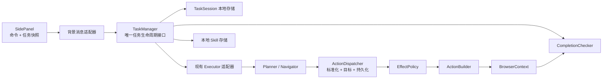
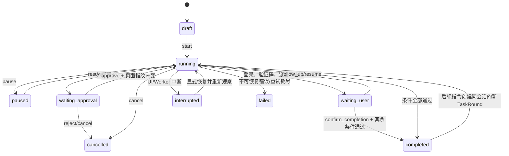
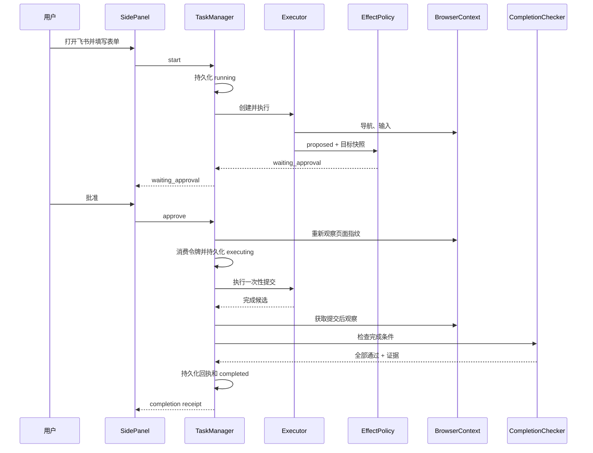

# 001 — 浏览器行动任务运行时

## 状态

**partially-outdated（L4 壳已落地，执行核仍默认 Nano）。**

- 已实现：`TaskManager`、`ActionDispatcher`、`CompletionChecker`、审批令牌、媒体 target digest、本地 Skill 基础、侧栏任务快照与人类时间线。
- 未按终局实现：生产默认执行核仍为 Nano Planner/Navigator；可换核与 P1 控制环见 **`design/002`**。
- 文中「空文件 `manager.ts`」「全局 `currentExecutor`」等 2026-07-13 描述已过时；以代码与 `design/002` 为准。

## 决策摘要

在现有 Chrome 扩展内增加一个深的 `TaskManager` 模块，统一拥有单任务生命周期、Executor 路由、持久化、动作审批和完成验证。侧边栏只发送命令并渲染任务快照；Planner 可以建议完成，但只有运行时检查通过后，任务才能进入 `completed`。

首轮保留一个活动任务，保存最小本地 Skill，不造新浏览器、不做并行 Agent、不执行任意生成脚本。

## 要解决的问题

现有代码已经会导航、点击、输入、切换标签页、暂停/恢复和执行后续任务，但还不能提供可信的委托契约：

- 任务所有权散落在背景入口和侧边栏连接生命周期中；
- 侧边栏断开会取消任务；
- Planner 的 `done=true` 直接成为任务成功；
- 后续指令依赖内存中的 Executor；
- 历史回放复用旧动作和元素索引，不是可适应页面变化的 Skill；
- 没有覆盖所有动作路径的统一外部副作用审批。

## 功能要求

- 在真实 Chrome 登录态中完成多步网页任务。
- 同一任务中的“暂停它”“继续填写”等指令必须绑定原目标。
- 支持 URL、可见文字、元素状态、HTML 媒体状态和用户确认五类完成条件；条件必须绑定执行轮次、目标、基线和新鲜度。
- 提交、购买、发送、发布、删除和权限变更必须在执行前审批。
- Worker 或侧边栏生命周期中断后保留语义状态，显式恢复时先重新观察页面。
- 已验证任务可保存为本地 Skill，并使用新输入重新规划执行。
- 重复或竞争命令必须按任务串行、按 revision 校验，并以 client command ID 保证幂等。

## 非功能要求

- 侧边栏命令在本地 200ms 内返回已接收或校验错误；模型和网页延迟不计入该目标。
- 一个活动任务，动作串行执行；不设计吞吐扩展。
- 命令在 200ms 内只返回接收/校验结果；模型和网页执行通过事件异步推进。
- 每个动作状态转换先持久化，再向 UI 发事件。
- 外部提交必须具备一次性审批令牌，并以 `proposed → approved → executing → observed/uncertain` 持久化；恢复时不得自动重复。
- 用户主动输入的本地聊天消息可保留原指令；运行时生成的事件、历史、回执、分析和日志不得复制凭证、表单值、完整页面正文或 Skill 运行值。

## 现有架构与目标差距

### 可复用模块

- `background/browser/context.ts`：标签页附着、切换和页面观察。
- `background/agent/executor.ts`：Planner/Navigator 循环、后续任务、取消与回放。
- `background/agent/actions/builder.ts`：通用动作实现。
- `packages/storage/lib/base/base.ts`：Chrome 本地存储封装。
- `packages/storage/lib/chat/history.ts`：聊天会话和执行历史。
- `packages/storage/lib/prompt/favorites.ts`：现有收藏提示词存储与 UI 入口。
- URL 防火墙和提示词注入过滤继续保留。

### 必须改变的模块

- `background/index.ts` 不再拥有 `currentExecutor` 的生命周期，只做 Chrome 事件接线和命令适配。
- 空文件 `background/task/manager.ts` 成为任务生命周期的主要模块。
- Navigator 动作分发路径增加唯一 `ActionDispatcher`；`EffectPolicy` 成为其内部纯模块。
- Planner 输出只提供候选完成信号；`CompletionChecker` 负责最终证据判定。
- 侧边栏从本地布尔状态推断，改为渲染持久化的任务快照。

## 高层结构



## 模块与接口

### TaskManager

`TaskManager` 是深模块：调用者只需要理解命令、任务快照和事件，不需要理解 Executor、Worker 恢复、审批令牌或完成证据的内部顺序。

公开接口保持为三个操作：

```ts
type TaskCommand =
  | { type: 'start'; commandId: string; taskId: string; instruction: string; chatSessionId: string; instructionMessageId: string; tabId: number }
  | { type: 'follow_up'; commandId: string; taskId: string; expectedRevision: number; instruction: string; chatSessionId: string; instructionMessageId: string }
  | { type: 'approve'; commandId: string; taskId: string; expectedRevision: number; roundId: string; approvalId: string }
  | { type: 'reject'; commandId: string; taskId: string; expectedRevision: number; roundId: string; approvalId: string }
  | { type: 'pause'; commandId: string; taskId: string; expectedRevision: number }
  | { type: 'resume'; commandId: string; taskId: string; expectedRevision: number }
  | { type: 'cancel'; commandId: string; taskId: string; expectedRevision: number }
  | { type: 'confirm_completion'; commandId: string; taskId: string; roundId: string; criterionId: string; expectedRevision: number }
  | { type: 'save_skill'; commandId: string; taskId: string; expectedRevision: number; roundId: string; title: string; instructionTemplate: string }
  | { type: 'run_skill'; commandId: string; taskId: string; skillId: number; values: Record<string, string>; tabId: number };

dispatch(command: TaskCommand): Promise<CommandAck>;
snapshot(taskId: string): Promise<TaskSnapshot>;
subscribe(listener: (event: TaskEvent) => void): () => void;
```

`dispatch` 只校验命令、检查 revision/幂等、排入该任务的串行队列并快速返回 ACK。Executor 和页面动作不阻塞 ACK；结果通过事件和 `snapshot` 呈现。

接口不暴露 Planner、Navigator、Chrome Port 或持久化调用顺序。背景消息适配器将现有 `new_task`、`follow_up_task`、`pause_task`、`resume_task`、`cancel_task` 和新增审批/Skill 消息映射为命令。

并发规则：已有活动任务时拒绝新的 `start`；`follow_up` 在下一个安全动作边界进入新轮次；`pause/cancel` 在下一个动作前生效；`approve/reject` 必须匹配当前 approval 和 revision；`confirm_completion` 只接受当前 waiting-user round 中指定的 `user_confirmed` criterion；重复 command ID 返回原 ACK，不重复执行。

### Executor 适配器接缝

`TaskManager` 通过一个窄的 `createExecutor → ExecutorDriver` 工厂接缝创建执行核（见 `task/contracts.ts`）。

- 生产可插多个后端：`nano`（现有 Planner/Navigator）、`control`（P1 级控制环，见 `design/002`）。
- 测试适配器产生确定性动作、完成候选和错误，使任务状态机脱离 LLM 和 Chrome。
- 调用者只需要：启动或追加指令、取消，以及接收动作/完成候选事件。核内部消息历史、模型实例不进入任务存储。

### ActionDispatcher

`ActionDispatcher` 是 Navigator 唯一可执行动作的模块。当前 `doMultiAction()`、单动作和任何保留的执行入口都必须调用它，不得直接调用 `Action.call()`。

每个动作按固定顺序处理：

1. 校验并标准化动作参数；
2. 从当前 BrowserState 解析目标元素、活动表单或媒体目标快照；
3. 生成动作专用的脱敏持久化表示；
4. 写入 `ActionAttempt(proposed)`；
5. 调用 EffectPolicy；
6. 允许则写入 `executing` 后调用真实动作；需要审批则停止本批剩余动作并进入 `waiting_approval`；禁止则失败；
7. 动作后重新观察并写入 `observed`，或在结果未知时写入 `uncertain`。

批准后必须重新读取页面指纹，只执行那一个已批准动作；页面已变化则作废并重新规划。内存中的原始参数不会跨冷恢复使用。持久化表示不得包含输入值；如果准确重放需要敏感值，冷恢复只能重新规划或请用户处理。

旧 raw replay 无法满足此约束：TaskManager 上线时禁用 replay 命令，删除 `chat_agent_step_*` 原始历史，并用本地 Skill 取代。不存在绕过 Dispatcher 的 replay 路径。

### EffectPolicy

`EffectPolicy` 是纯模块：输入标准化动作、当前目标摘要和 Skill 审批策略，输出：

```ts
type EffectDecision =
  | { kind: 'allow'; effect: 'read' | 'reversible' }
  | { kind: 'approval'; effect: 'external_commit'; summary: string }
  | { kind: 'block'; reason: string };
```

接缝位于 ActionDispatcher 内部，而不是散落在点击、键盘和表单处理器中。这样 `click_element` 与 `send_keys Enter` 不能绕过同一策略。

第一版使用保守规则：动作类型、Planner 意图和目标元素/活动表单的文字与属性共同分类；`Enter` 或目标不明 click 默认请求审批。审批只针对当前 round、动作和页面指纹生效一次。

### CompletionChecker

`CompletionChecker` 是纯模块，输入经过过滤的页面观察和已声明条件，输出逐项证据：

```ts
type CompletionCriterion =
  | CriterionBase & { kind: 'url'; operator: 'equals' | 'starts_with' | 'changed'; expected?: string }
  | CriterionBase & { kind: 'text'; operator: 'present' | 'absent'; expected: string }
  | CriterionBase & { kind: 'element_state'; operator: 'equals'; expected: string }
  | CriterionBase & { kind: 'media_state'; operator: 'equals'; expected: 'playing' | 'paused' }
  | CriterionBase & { kind: 'user_confirmed'; operator: 'confirmed' };

interface CriterionBase {
  id: string;
  roundId: string;
  targetRefId: string;
  baseline: unknown;
  frozenAt: number;
  notBefore: number;
  timeoutMs: number;
}
```

Planner 第一次规划时提出条件，TaskManager 校验类型、目标和强度，并在执行或外部提交前冻结。状态改变型任务至少需要一个基线尚未满足、且必须在相关动作后产生的新证据；预先成立的弱条件不能证明完成。

Planner 报告完成后，TaskManager 重新观察绑定目标并检查所有必需条件：

- 全部通过：写入回执并进入 `completed`；
- 可检查但失败：把失败证据反馈给 Executor 继续处理；
- 无法检查：进入 `waiting_user`，由用户确认或调整目标；
- 外部提交后的状态不明：进入 `waiting_user`，不得自动重试。

用户确认不是普通聊天文本。侧边栏必须针对具体条件显示确认按钮并发送 `confirm_completion(taskId, roundId, criterionId, expectedRevision, commandId)`。TaskManager 校验当前 round、条件类型和 revision 后写入来源为 `user` 的 CompletionEvidence，再重新计算本轮完成状态。旧 round、错误 criterion、过期 revision 和重复 command ID 都不能重复或错误完成任务。

### TaskSession 与 TaskRound 存储

使用现有 `createStorage` 和 `chrome.storage.local`，以现有聊天会话 ID 作为任务 ID，避免双重身份。

```ts
type TaskStatus =
  | 'draft'
  | 'running'
  | 'paused'
  | 'waiting_approval'
  | 'waiting_user'
  | 'inputs_required'
  | 'interrupted'
  | 'completed'
  | 'failed'
  | 'cancelled';

interface TaskSession {
  id: string;
  goalSummary: string;
  chatSessionId?: string;
  instructionMessageId?: string;
  sourceSkillId?: number;
  status: TaskStatus;
  revision: number;
  progressSummary: string;
  targetRefs: BrowserTargetRef[];
  currentRoundId: string;
  rounds: TaskRound[];
  pendingApproval?: ApprovalSummary;
  createdAt: number;
  updatedAt: number;
}

interface TaskRound {
  id: string;
  instructionMessageId?: string;
  instructionSummary: string;
  status: TaskStatus;
  criteria: CompletionCriterion[];
  attempts: ActionAttempt[];
  approvals: ApprovalSummary[];
  evidence: CompletionEvidence[];
  receipt?: CompletionReceipt;
  commandAcks: Record<string, CommandAck>;
}
```

每个后续指令创建新 TaskRound；旧 round 的回执不可变，解决“连续控制却只有一张 receipt”的冲突。用户主动写入本地聊天的消息是普通任务原始指令的唯一持久副本，TaskSession/TaskRound 只保存 `chatSessionId + instructionMessageId` 引用和脱敏摘要；冷恢复按引用读取聊天消息。Skill 任务只保存 `sourceSkillId`，不保存解析后的输入。存储语义摘要、目标引用、原始 CommandAck 和脱敏证据，不存 LangChain 对象、DOM Node、旧元素 index、截图、凭证或完整表单值。

### 本地 Skill

首轮复用现有收藏提示词入口和存储模式，在条目上增加可选结构字段。旧收藏默认视为 `prompt`，无需迁移用户内容。

```ts
interface LocalSkill {
  kind: 'skill';
  name: string;
  instructionTemplate: string;
  inputs: SkillInput[];
  criteria: CompletionCriterion[];
  approvalPolicy: 'default' | 'always_confirm_commits';
  sourceTaskId: string;
  version: 1;
}
```

Skill 只保存语义指令、输入 schema 和完成契约，不保存上次运行的输入值。运行时替换当前输入并创建新 TaskSession，继续由模型根据当前页面重新规划；不保存或执行历史元素索引，也不生成任意 JavaScript。

## 任务状态机



`completed` 后的后续指令保留同一 TaskSession 身份和目标引用，但产生新的 TaskRound、动作、审批、证据和回执；不会修改上一轮回执。每个 UI 命令都有 command ID，同一 command ID 只影响一次状态。

## 关键数据流

### 启动并完成表单任务



### 冷恢复

扩展启动时，任何持久化为 `running`、`paused` 或 `waiting_approval` 但不存在活动 Executor 的普通动作都改为 `interrupted`。任何外部提交 ActionAttempt 为 `executing` 且没有 `observed` 的 round 必须进入 `waiting_user` 并标记 `uncertain`。恢复时先检查目标标签页和 URL：

- 目标仍存在：用目标、进度摘要、条件和当前观察创建新 Executor；
- 目标消失：进入 `waiting_user`，请用户选择当前标签页重新绑定；
- 上次外部提交处于 `executing` 或可能已执行但没有新鲜证据：进入 `waiting_user`，绝不自动重复。

普通任务显式恢复时，可从 `chatSessionId + instructionMessageId` 重新取得原指令。Skill 运行的已解析输入只存在内存；若运行被冷中断，任务进入 `inputs_required`，界面重新索取输入并创建新任务，不把输入值写入 TaskSession、聊天或 Skill。

## 浏览器目标引用

`BrowserTargetRef` 保存 `tabId`、URL、标题、目标类型和少量语义提示。它不承诺跨浏览器重启保持 DOM 精确定位。

后续指令按以下顺序解析：

1. 仍存在且 URL 合理的最近目标；
2. TaskSession 中同类型目标；
3. 当前活动标签页，经用户确认重新绑定；
4. 无法消歧时进入 `waiting_user`。

M3 必须提供站点无关的 HTML 媒体观察；状态至少包含 `playing/paused`、当前标签和媒体目标指纹。控制可优先复用现有点击/键盘动作，但如果无法稳定命中，则增加站点无关的 `control_media(play|pause)`。禁止添加 B 站专用动作。

## 安全与隐私

- 继续使用 URL 防火墙和不可信网页内容包装/过滤。
- 外部提交审批必须位于共享动作分发接缝。
- 审批令牌包含任务 ID、动作摘要和页面指纹，仅使用一次。
- 批准后页面指纹变化则令牌失效并重新规划；令牌必须在浏览器调用前消费并写入 `executing`。
- 登录、密码、支付信息和 CAPTCHA 由用户完成。
- ActionDispatcher 按动作 schema 生成脱敏事件、历史和日志；`input_text` 等动作只保留字段类型/目标摘要，不保留值，错误日志不得 `JSON.stringify(actionArgs)`。
- TaskManager 上线时禁用旧 replay，并删除可能含 `input_text` 参数的 `chat_agent_step_*` 原始历史。
- 用户主动发送的本地聊天消息可按现有产品行为保留；凭证不进入聊天、TaskSession 或 Skill，运行时不得再次复制普通输入值。
- TaskSession/TaskRound 只引用普通任务的用户聊天消息；Skill 运行输入不写聊天，冷恢复时重新输入。
- Skill 不允许保存 secret 类型输入；疑似凭证只在当前任务内使用且不写入 Skill。

## 失败处理

| 失败 | 状态 | 处理 |
|---|---|---|
| 模型解析/临时动作失败 | `running` | 复用现有重试预算，失败证据反馈给 Planner |
| 登录或 CAPTCHA | `waiting_user` | 用户在原页面处理后显式继续 |
| 目标标签页关闭 | `waiting_user` | 选择或重新打开目标后绑定 |
| URL 被防火墙拒绝 | `failed` | 不绕过策略，展示原因 |
| 审批前页面变化 | `running` | 作废审批动作并重新规划 |
| 外部提交在 `executing` 后 Worker 中断 | `waiting_user/uncertain` | 展示可能已提交，不自动重试 |
| 完成条件失败 | `running` | 将具体失败条件反馈给 Executor |
| 完成条件不支持 | `waiting_user` | 用户确认或修改任务 |

## 可观测性

沿用当前执行事件并增加任务级事件：状态变化、审批请求/结果、条件检查、验证完成、Skill 保存和 Skill 运行。每个任务事件都携带 `taskId`、`roundId` 和 `revision`，侧边栏忽略旧 revision，避免重连后状态回退。

健康定义：

- 没有 `completed` 任务缺失通过证据；
- 没有外部提交缺失审批记录；
- 没有从 `executing` 冷恢复后重复的外部提交；
- 没有 `running` 任务在扩展重启后继续显示为运行中；
- fixture 的表单和媒体旅程连续 10 次通过。

分析只记录事件类型、耗时、失败分类和计数，不记录用户输入或页面正文。

## 测试接缝

1. 纯状态转换：命令/事件输入，TaskSession 输出。
2. 命令队列：revision、重复 command ID、start/follow-up/approve/reject/pause/resume/cancel/confirm_completion 竞争。
3. ActionDispatcher + EffectPolicy：目标解析、批处理停止、点击/Enter 审批、脱敏和批准后精确执行。
4. CompletionChecker：round/target/operator/baseline/freshness 条件与观察输入，逐项证据输出。
   - 专用完成确认测试覆盖当前条件、旧 round、错误 criterion、过期 revision 和重复确认。
5. TaskManager + 测试 Executor 适配器：覆盖启动、后续、审批、恢复、失败和完成。
6. 重启注入：在 `proposed`、`approved`、`executing`、`observed` 后分别重启，证明没有重复外部提交。
7. 背景消息适配器：现有消息到 TaskCommand，再到 TaskEvent/TaskSnapshot。
8. 隐私检查：Chrome storage、UI event、analytics 和 logger 不含输入值；旧 raw replay 数据被删除。
9. Chrome fixture E2E：表单提交与 HTML5 媒体。
10. 真实 Chrome：飞书和 B 站，按预注册有效尝试协议记录产品、模型、网站、登录和环境失败。

测试应通过模块接口验证行为，不越过 TaskManager 接缝读取内部实现。

## 分阶段实现顺序

1. TaskSession/TaskRound 状态机、命令队列、revision、存储和 TaskManager 接线；不改变动作行为。
2. 禁用旧 replay、删除 raw history，并建立动作 schema 脱敏。
3. ActionDispatcher、EffectPolicy、持久化动作协议、审批消息/UI 和表单 fixture。
4. CompletionChecker、基线/新鲜度、回执和“Planner 完成不等于任务完成”。
5. 后续目标绑定、必需的 HTML 媒体观察/控制和 B 站旅程。
6. 在现有收藏入口上增加本地 Skill 保存与运行。
7. 全量回归、真实 Chrome 固定协议验收和文档同步。

每一步都必须留下可运行检查，不允许同时重写 Planner、Navigator、BrowserContext 和侧边栏。

## 取舍

### 扩展内运行时，而不是独立浏览器

赢得真实登录态、最小迁移和现有代码复用；放弃 Chrome 关闭后的持续执行和完全可控的浏览器进程。

### 深 TaskManager，而不是继续补全局变量

调用者多学习一个命令联合类型和任务快照，却不再需要知道 Executor、Port、持久化和恢复顺序。测试可以从同一接口覆盖完整生命周期，获得更高局部性。

### 支持有限的确定性条件，而不是通用 LLM 验证器

赢得可解释证据和低误报；放弃第一版对所有网页结果的自动判断。无法检查时明确交给用户。

条件必须在动作前冻结并绑定 round、target、baseline 和 freshness，这增加了少量数据结构，但避免 Planner 自己定义一个已经成立的弱条件再宣布成功。

### 语义 Skill，而不是动作回放或生成脚本

赢得页面变化适应性和更小安全面；放弃最快的机械重放和 Tabbit 式任意脚本能力。

### 显式中断恢复，而不是 Offscreen 后台常驻

赢得更小实现和清晰副作用语义；放弃关闭侧边栏后持续执行。只有真实需求超过当前设计上限时才增加常驻机制。

## 假设

- 首轮只有一个活动任务。
- 用户在需要时保持 Chrome 打开，并接受中断后的显式恢复。
- 飞书表单成功状态和 B 站 HTML5 媒体状态可被扩展观察。
- 当前 BrowserContext 和动作原语足以执行大部分步骤。
- 站点无关 HTML 媒体状态可以通过扩展页面观察获得；若不成立，M3 必须停下重新设计而不是增加 B 站专用代码。
- MiniMax 在现有解析加固后能生成符合模式的动作和完成条件。
- 本地 Skill 不需要共享、同步或权限管理。

## 何时重新评估

- 超过 20% 的有效任务因完成条件不支持而要求用户确认：扩展条件类型或引入独立验证 Agent。
- 用户持续需要关闭侧边栏后执行：评估 Offscreen Document 或原生浏览器进程。
- 出现并行任务的真实需求：把单任务 TaskManager 扩展为按 ID 管理的运行时；此前不提前实现。
- Skill 在页面小改动后的验证成功率低于 80%：加强语义目标定位或 Skill 契约，不退回旧索引回放。
- 扩展生命周期导致任一重复外部提交：立即关闭自动恢复外部提交路径并重新设计幂等策略。
- 运行时生成的任何持久化记录或日志出现表单/Skill 值：阻止发布并扩大脱敏边界。

## 边界

- 本设计只覆盖 Chrome 扩展内的单用户、单活动任务。
- 不覆盖独立浏览器、云端执行、桌面应用控制、并行 Agent、企业权限、计费或 Skill 市场。
- 不允许飞书、B 站专用硬编码；新增能力必须是站点无关动作或观察。
- 不允许 Planner 单独决定任务成功。
- 不允许任何动作路径绕过共享 EffectPolicy。
- 不允许 Navigator、multi-action 或旧 replay 绕过 ActionDispatcher；旧 raw replay 在首轮被禁用和迁移删除。
- 不允许恢复逻辑自动重复状态不明的外部提交。
- 不允许 Skill 保存凭证、旧 DOM index 或任意生成 JavaScript。
- 不允许没有 round/target/baseline/freshness 的条件证明状态改变型任务完成。
- 修改以上规则必须同时更新本设计、PRD 和对应验收测试。

## 参考

- `CONTEXT.md`
- `.ship/tasks/plan-large-nanobrowser-second-development/product/08-prd.md`
- `.ship/tasks/plan-large-nanobrowser-second-development/product/09-tech-project-plan.md`
- `decisions/001-keep-chrome-extension`
- [Tabbit 官方使用指南](https://www.tabbit.com/guide/usage)
- [OpenAI Atlas 能力迁移说明](https://help.openai.com/en/articles/20001371-evolving-atlas-into-chatgpt-for-browser-based-agentic-work)
