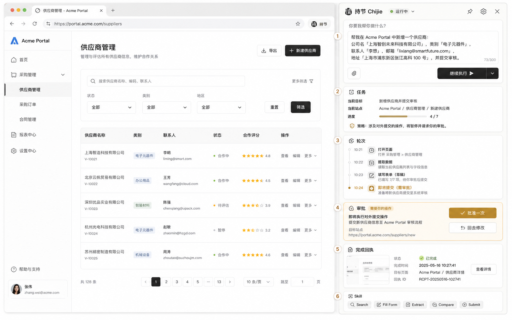
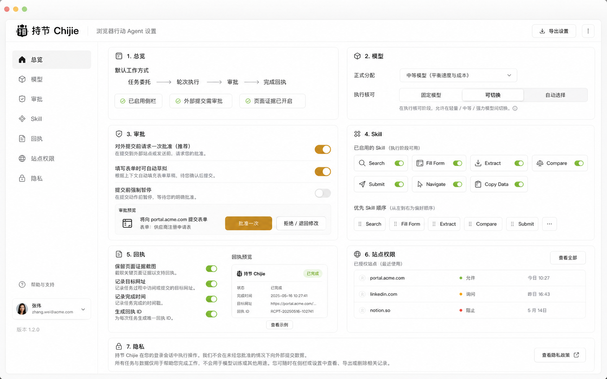

# 003 — 持节 v1 交互设计

## Status

**draft（交互稿定稿；UI-1–5 信息架构已落地，像素级与附图可继续微调）。**

- 源图：Owner 确认的两张 ChatGPT 产品交互稿（2026-07-15）。
- 品牌：持节 / Chijie。
- **2026-07-15：** 侧栏 TaskStatusCard 分块 + Options `OverviewSettings`（流水线/模型/审批/Skill 语义/回执/站点占位/隐私）+ 执行核 control|nano 切换。
- 像素级与附图完全一致、持久化审批开关前可保持 draft；行为契约已接 Task。

## Summary

持节是 **浏览器行动 Agent** 侧栏 + 设置：自然语言委托多步网页操作；对外提交一次批准；页面证据才算完成并出回执。  
本设计把主路径拆成侧栏六块、设置七块，并映射到现有 Task 契约与代码目录。

## Source assets (canonical)

| 文件 | 场景 |
|------|------|
| [ui/chijie-sidepanel-task-main.png](ui/chijie-sidepanel-task-main.png) | 侧栏主路径（任务运行中 + 审批 + 回执） |
| [ui/chijie-options-overview.png](ui/chijie-options-overview.png) | 设置总览（契约 / 模型 / Skill / 站点 / 隐私） |

原下载名（仅溯源，勿再引用）：

- `~/Downloads/ChatGPT Image 2026年7月15日 02_31_26 (1).png` → sidepanel
- `~/Downloads/ChatGPT Image 2026年7月15日 02_31_26 (2).png` → options

## Product north star (do not redesign away)

用户可见完成态（`product/003`）：

1. 侧栏只见「你 / 助手」、目标、状态、下一步；不见 Planner/Navigator/step_failed。
2. 表单：填完 → 提交前停 → 批准后只提交一次 → 证据 → 回执。
3. 媒体：播放后「暂停这个」绑同一对象 → 真暂停 → 回执。
4. 成功可存本地 Skill 重跑。
5. 未批准绝不外部提交；证据不足不得显示已完成。

**不是：** 网页第二大脑、SignalGraph、浏览沉淀知识画布。

## Screen A — Side panel (task main)



### Annotated blocks

| # | 设计块 | 用户看到什么 | 产品语言 | 代码落点（目标） |
|---|--------|--------------|----------|------------------|
| 1 | 委托输入 | 「你要我帮你做什么」+ 继续执行 | 任务指令 / 跟进 | `SidePanel` 输入 → `TaskCommand.start` / `follow_up` |
| 2 | 任务卡 | 当前目标、站点、进度 4/7、策略提示 | Task + Round 摘要 | `TaskSnapshot` / `TaskStatusCard` |
| 3 | 轮次时间线 | 打开页面 / 提取 / 填表 / 即将提交 | 人类可读轮次，非机器角色 | 人类时间线 + task events |
| 4 | 审批卡 | 即将对外提交；批准一次 / 回去修改 | 外部提交 + 一用审批 | `waiting_approval` → `approve` / `reject` |
| 5 | 完成回执 | 已完成、时间、目标页、回执 ID、详情 | Completion receipt | `receipt` + verified complete |
| 6 | Skill 条 | Search / Fill Form / … | **语义 Skill 入口**（见边界） | `favorites` / Skill 存储 |

### Side-panel layout rules

- 右栏固定扩展宽度；左为真实网页（用户登录态）。
- 顶部品牌：**持节 Chijie** + 运行状态（运行中 / 等待审批 / 已完成）。
- 主色：白 / 灰；审批用琥珀语义色；成功用绿勾。
- 禁止侧栏出现 Planner、Navigator、step_failed、原始 DOM index。

## Screen B — Options overview



| # | 设计块 | 含义 | 实现优先级 |
|---|--------|------|------------|
| 1 | 总览流水线 | 任务委托 → 轮次 → 审批 → 回执 | P0 文案 + 状态开关 |
| 2 | 模型 | 正式分配 = 中等模型；执行核可切换 | P0（对齐 G5/G6） |
| 3 | 审批 | 对外一次批准；填表可草稿；提交前暂停 | P0 策略开关 |
| 4 | Skill | 启用项与顺序 | P1（M4） |
| 5 | 回执 | 截图/URL/时间/回执 ID | P0 展示；截图 P1 |
| 6 | 站点权限 | 允许 / 询问 / 阻止 | P2 占位可接受 |
| 7 | 隐私 | 登录态、不外提未批数据、不训模型 | P0 文案 + G7 行为 |

左导航：总览、模型、审批、Skill、回执、站点权限、隐私。

## Mapping — design ↔ runtime contract

```text
委托输入  → TaskCommand.start / follow_up
任务卡    → TaskSession + current Round
轮次线    → Round attempts（脱敏）+ UI 人类文案
审批卡    → EffectPolicy external_commit + approval token
完成回执  → CompletionChecker pass → immutable receipt
Skill     → 本地 Skill 定义（配方），不是原子 tool 开关墙
设置-模型 → agent models + agentCoreBackend (control|nano)
设置-隐私 → 存储脱敏；无表单值进非聊天存储
```

## Boundaries

### In scope for UI impl from this doc

- Side panel structure matching blocks 1–5（6 需先对齐 Skill 产品定义再做）。
- Options overview cards 1–3、5、7 的信息架构。
- 文案与状态机展示与 `design/001` Task 状态一致。

### Out of scope / reject

- 中栏知识节点画布、浏览轨迹「第二大脑」。
- 把 Skill 做成与「可验证任务配方」无关的 8 个永久 tool chip 主叙事。
- 蓝紫霓虹、粒子、过度玻璃拟态压过任务内容。
- 显示内部 Agent 角色名。

### Assumptions

1. 扩展仍为 Chrome MV3 侧栏，非独立浏览器。
2. 正式准确率仍用中等模型（默认 MiniMax-M3）。
3. 附图为交互与信息架构源；像素可在实现时按 `chijie-tokens` 微调。

## Implementation slices (suggested)

| Slice | Done when | Status |
|-------|-----------|--------|
| UI-1 | 侧栏：任务卡 + 轮次线 + 审批卡视觉对齐附图 | **done** (2026-07-15) |
| UI-2 | 侧栏：完成回执卡 + 无机器角色泄漏 | **done** (receipt meta + humanize timeline) |
| UI-3 | 设置总览：流水线 + 模型 + 审批 + 隐私四卡 | **done** (OverviewSettings) |
| UI-4 | Skill 条：仅在 PRD Skill 语义下接入，否则隐藏或降级 | **done** (overview explains recipe; no tool-chip wall) |
| UI-5 | 站点权限：只读列表或占位，不阻塞主路径 | **done** (placeholder card) |

## Visual direction (short)

- macOS 设置 / Safari 旁栏气质：留白、细分割线、高信息密度但不挤。
- 黑白灰 + 少量语义色（审批琥珀、成功绿、危险红）。
- 内容优先：目标与审批按钮优先于 Logo 装饰。

## References

- `product/003` 北极星用户可见完成态
- `product/001` PRD 任务 / 审批 / 回执 / Skill
- `design/001` Task 运行时
- `design/002` 可换核
- 资产目录：`docs/design/ui/`
