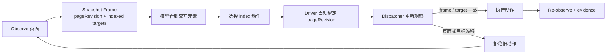

# 007 — ego-lite 启发：Snapshot Frame

## 结论

ego-lite 最值得持节立即吸收的不是它的浏览器外壳，而是一个更小、更深的机制：

> 每次页面 Snapshot 都是一个不可变操作帧；元素 ref 只在该帧内有效。页面变化后，旧 ref 必须失效，而不是继续猜。

这直接补 `product/014` B2 的缺口，同时保持 `decisions/001`：持节仍是日常 Chrome 里的扩展，不 fork 浏览器。

## 源码事实（2026-07-30 读取 main@`f260b217`）

| ego-lite 模块 | interface / 行为 | 对持节的判断 |
|---|---|---|
| [`ref-map.ts`](https://github.com/citrolabs/ego-lite/blob/main/package/ego-browser/src/ref-map.ts) + [`ref-state.ts`](https://github.com/citrolabs/ego-lite/blob/main/package/ego-browser/src/ref-state.ts) | 每次 snapshot 重建 ref map；ref 跨轮为空时自动补 snapshot | **立即吸收语义**：index 是短生命周期 ref，不是稳定主键 |
| [`element-resolver.ts`](https://github.com/citrolabs/ego-lite/blob/main/package/ego-browser/src/element-resolver.ts) | 统一解析 ref / locator；失败分 transient / permanent | **分阶段吸收**：本切片先做 stale frame reject，locator 与失败分类后续按 TSR 决定 |
| [`helpers.ts`](https://github.com/citrolabs/ego-lite/blob/main/package/ego-browser/src/helpers.ts) | helperContext 是能力面的单一来源 | 持节已有 ActionBuilder registry，不另起一套浅封装 |
| Task Spaces | agent/user ownership + 接管/交还 | **不照搬外壳**；未来只借 ownership 语义加固 task-tab attach |
| [`learning/`](https://github.com/citrolabs/ego-lite/tree/main/package/ego-browser/src/learning) | 站点经验包有 manifest、校验与执行 seam | Phase 2 候选；Claw 30 parity 未完成前不扩为记忆产品 |
| stdin JavaScript 批执行 | Agent 在一次输出中组合多步 helper | **当前不采用**；持节要保留一动作一观察、审批和证据裁决 |

## 持节的深模块

新增 interface：

```ts
captureActionFrame(pageState, liveUrl?) -> { pageRevision, targetCount }
bindIndexedActionToFrame(args, pageRevision) -> boundArgs
```

实现隐藏了：

- selector map 的稳定排序；
- 每个目标的 branch / attributes / xpath / 可见语义文本 hash；
- URL、tab 与 origin 归一；
- `pageRevision` 生成；
- 只有 index 动作才携带 frame binding。

调用方不需要理解这些细节，因此它是一个深模块，而不是把 hash 逻辑散在 prompt、Page 和 dispatcher 三处。

## 运行时数据流



## 不变量

1. 模型不负责手抄 `pageRevision`；driver 从刚刚的 observation 自动绑定。
2. 只有带 `index` 的动作绑定 frame；导航、媒体、tab 继续使用各自的 target digest / evidence seam。
3. action schema 可以丢弃 `page_revision`，因为 dispatcher 在 parse 前读取 raw args。
4. 批准等待后仍以 target digest 重新验证具体提交控件；不能因页面小变化把批准扩散到另一个目标。
5. `pageRevision` 只进内部 prompt / runtime / tests，不进入用户侧栏。

## 本切片范围

已完成：

- control observation 产出 Snapshot Frame；
- index 动作自动绑定当前 frame；
- mutate 前刷新交互快照；同页 DOM 重排或控件改名也会让旧 frame 失效；
- Page 的 before/after observation 返回同一套 frame identity；
- TaskManager 把 identity 交给 ActionDispatcher；
- stale frame 复用已有 `stale_page_revision` fail-closed 路径；
- 外部提交的持久化 Activity 摘要不再保存任意 intent，防止表单值泄漏。

未完成：

- role / label / testid 等稳定 locator；
- transient / permanent 的第一类错误；
- iframe / shadow root 的 ref map；
- 真机动态 DOM TSR 对照。

这些不以“ego-lite 有”为完成理由；只有固定任务集 TSR 提升才继续深化。

## 验收

- 相同 snapshot 生成相同 revision；URL 或目标身份变化生成新 revision。
- 仅 index 动作自动携带当前 revision。
- stale revision 在 mutate 前被拒绝。
- 既有 action/approval/completion 回归全绿。
- 外部提交 snapshot 不含 intent 中的表单值。

验证记录：`reports/nanobrowser/2026-07-30-ego-snapshot-frame.md`。
