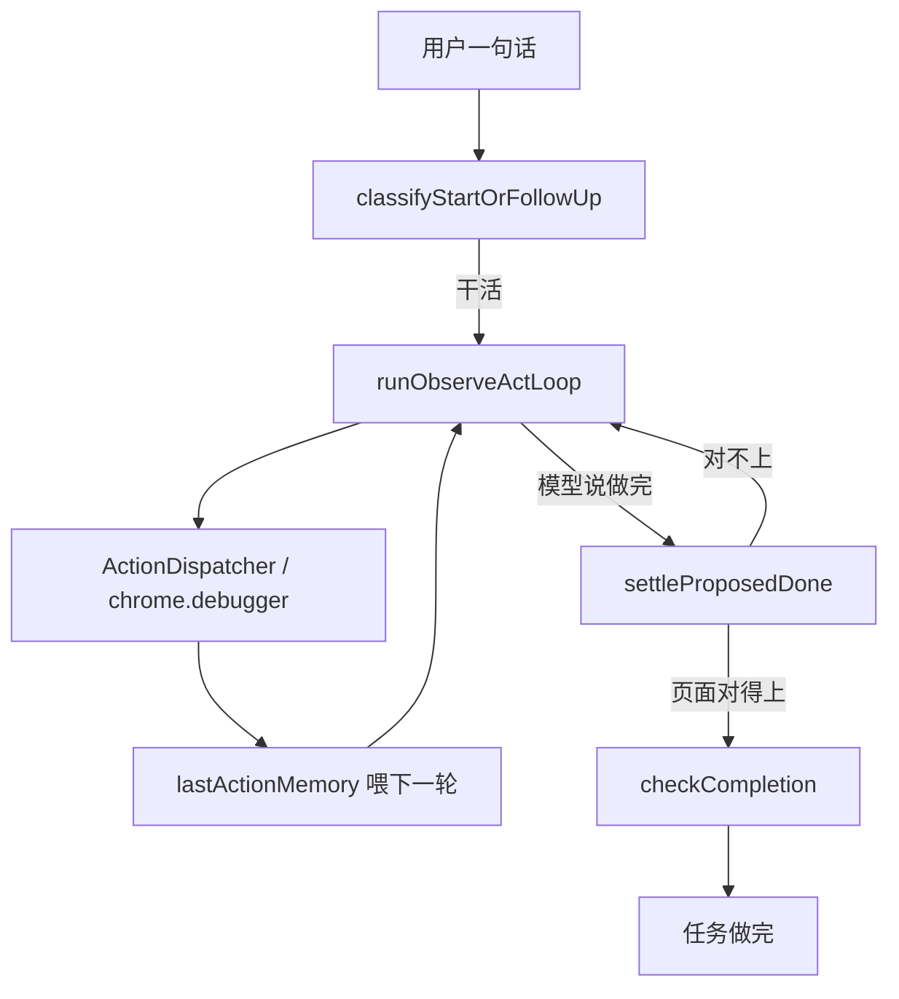

# 持节要采纳什么（书 21 章不是规格）

持节是浏览器自动化 Agent：用户派发任务，它操作相关标签页把任务做完。
侧栏是这次工作的窗口。
对照物是美团 Tabbit 的任务模式，不是全书、不是 Tabbit 整机壳。

成功标准：用户交出去的浏览任务，在 Chrome 里做完了，并且能对页核对。

## 采纳（机制，不是章号）

| 机制 | 书的章 | 持节对应 | 状态 |
|---|---|---|---|
| 先分清招呼和干活 | 2 | `classifyStartOrFollowUp` / `decideUserTurn` | 已在 `TaskManager.dispatch` |
| 操作页面（点、开、搜、填） | 5 | `parseControlPolicyDecision` → `ActionDispatcher` / `chrome.debugger` | 循环已接线；日常动作的 `Action.prompt()` 已进 `renderControlSystemPrompt` |
| 一步的结果喂下一步 | 1 | `lastActionMemory` + `<last_action_result>` | 读页类成功会喂；动作失败走 `memoryAfterAction` |
| 两件独立网址一起开 | 3 | `prepareIndependentInstructionTabs` | 已提交 `9dd319f` |
| 本任务已打开页带着走 | 8 / 14 / 21 | `formatVerifiedPagesForPrompt` 写入每一次 `buildControlUserPrompt` | 已提交 `9dd319f` |
| 模型说做完，第二次调用看页再信 | 4 | `settleProposedDone` → `supervisorLlm.invoke` | 已接线；拒收句已 `emitEvent` |
| 页面对得上才停 | 11 | `checkCompletion` / `persistVerifiedReceipt` | 已接线；挡下会 `addFollowUp` 再跑 |
| 失败后再试、启动失败给人话 | 12 | `classifyRetry`；`classifyCreateExecutorError` | 控件 `not found` 会再决定；启动失败走 `classifyCreateExecutorError` |
| 人能停、接管、改方向 | 13 | `takeover` / `pause` / `cancel` / `follow_up` | 已接线；默认不抢前台 |
| 默认不把用户正在看的页拽到前面 | 18 | `BrowserContext.switchTab` / `openTab` / `navigateTo` 后台附着 | 已接线 |
| 陌生任务先搜到页 | 21 | `search_google` | 已有动作 |

## 不采纳（做了会岔开，禁止开工）

| 不采纳 | 书的章 | 理由 |
|---|---|---|
| MCP 客户端/服务器 | 10 | 动作表是固定的，直接函数调用 |
| A2A / AgentCard | 15 | 侧栏到 `TaskManager` 不是两个智能体 |
| 预订部 / 问答部 / 多只专门智能体 | 7 | 一只 `createLlmControlDriver` 做完 |
| 向量库 RAG | 14 | 看眼前的页，不是跨库检索 |
| 预印「目标 / 阶段 / 计划」栏目 | 6 | 侧栏按发生的事往下长 |
| 自我一致性 / 思维树当产品 | 17 | 思考是为了下一步动作 |
| 完成卡「保存为可再运行」 | 9 | 活路径已去掉 |
| 多任务紧急度队列 | 20 | 同时一件 `start` |
| Tabbit「仅聊天 / 执行」闸门、默认跟随中、整机 Chromium | 壳 | 角色对齐任务模式，不对齐壳 |

## 这一轮改过的（没有它，任务更容易做不完）

已经落地进工作区，不再重做。

### 1. 模型能看见每个动作什么时候用

- 文件：`chrome-extension/src/background/agent/backends/control-policy.ts`
- 做法：`renderControlSystemPrompt` 附上日常动作的 `Action.prompt()`（`whenToUse` / `whenNotToUse` / examples）。
- 默认提示不得出现 `record_evidence`（现有测试锁定；调研说明只在 `research: true`）。
- Hard bar：`renderControlSystemPrompt()` 含 `click_element` 的 `When to use:`，以及 `input_text`、`search_google`、`go_to_url`。

### 2. 动作失败必须进下一轮决定

- 文件：`chrome-extension/src/background/agent/backends/control-llm.ts`
- `shouldKeepActionResultInContext('click_element') === false` 保持（成功点击下一帧观察就够）。
- `memoryAfterAction` 把 `result.error` 和 `act` 抛错写进 `lastActionMemory`。
- 成功且不 keep 时清掉旧的 `lastActionMemory`，失败句不会粘在成功点击之后。
- Hard bar：失败的 `click_element` 出现在下一轮 `<last_action_result>`；成功 `click_element` 仍不把摘要当内容留下。

### 3. 执行器启动失败走已有分类函数

- 文件：`chrome-extension/src/background/task/manager.ts`（`runCurrentRound` 的 `createExecutor` catch）
- 做法：用 `classifyCreateExecutorError`，删掉内联 `/noApiKeys|noNavigator|noProvider|setup/i`。
- Hard bar：中文「请先在设置页面中完成 API 密钥的设置。」→ `failureCategory === 'setup_failed'`。

### 4. 点不到的控件不能整轮停掉（开工时补上）

- 文件：`chrome-extension/src/background/agent/retry-policy.ts`
- 原因：`page.ts` 抛 `Element: … not found`；旧的 `classifyRetry` 把裸 `not found` 当成 `no_retry`，`runObserveActLoop` 立刻 `action_failed`。
- 做法：控件定位失败走 `retry`；`unknown action` / `invalid input` / `permission` 仍 `no_retry`。
- Hard bar：第一次点到已挪走的节点，循环再决定一次，而不是任务失败。
