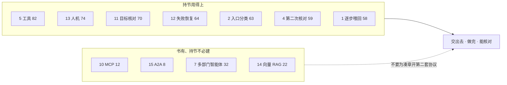
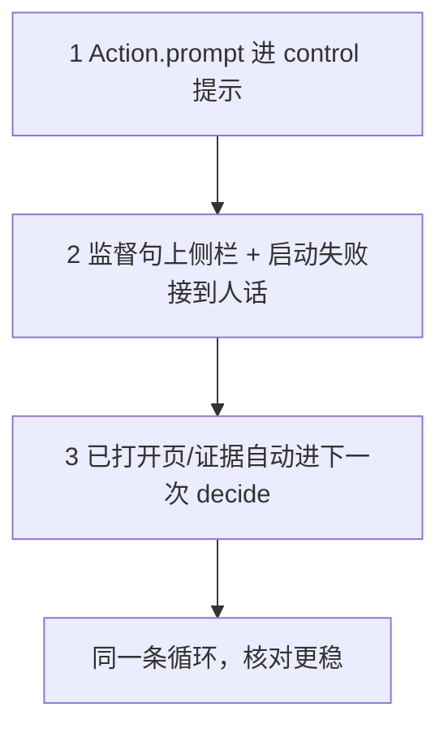

# 持节有没有做成《Agentic Design Patterns》

书：[xindoo/agentic-design-patterns](https://github.com/xindoo/agentic-design-patterns)（Antonio Gulli，21 章 + 附录）。
各章主源：`docs/research/agentic-design-patterns-audit/ch01.md` … `ch21.md`、`appendix.md`。
审查员：每章一个子代理，对照书的 Markdown 与持节仓库。

## 总判断

**没有「做完全书」。也不应该按 21 章逐项做成。**

这本书是一份模式目录，不是持节的产品规格。
持节是浏览器自动化 Agent：用户派发任务，它操作浏览器把任务做完。侧栏是看这次工作的窗口，不是产品本身。

循环已经接线，不等于任务已经能做完：

`SidePanel` 发 `start` / `follow_up`
→ `TaskManager.dispatch`（`classifyStartOrFollowUp`）
→ `createExecutorDriver` → `createLlmControlDriver`
→ `runObserveActLoop`（观察 → 决定 → 行动 → 再观察）
→ `ActionDispatcher` / `chrome.debugger`
→ `checkCompletion` / `settleProposedDone`（第二次模型调用）才停。

21 章算术平均约 **46**。这不表示产品只做了一半。
高分集中在「会点页面、会分类那一句、会核对再停、人能接管」。
低分集中在 MCP、A2A、多智能体市场、向量检索——这些不是把事做完的存在条件。

## 21 章总表

| 章 | 书名 | 结论 | 分 | 持节对应 | 对业务的意义 |
|---|---|---|---:|---|---|
| 1 | Prompt Chaining | 部分 | 58 | `runObserveActLoop` + `lastActionMemory` | 一步的结果喂下一步，长任务才能接着做 |
| 2 | Routing | 部分 | 63 | `classifyStartOrFollowUp` / `resolveUserTurnCheap` | 「你好」不建任务；「打开 YouTube」才动手 |
| 3 | Parallelization | 部分 | 58 | `prepareIndependentInstructionTabs` | 两个独立网址可以一起开；循环仍一步一决定 |
| 4 | Reflection | 部分 | 59 | `settleProposedDone` → `supervisorLlm.invoke` | 模型说做完了，第二次调用看页再信 |
| 5 | Tool Use | 部分 | **82** | `parseControlPolicyDecision` + `ActionDispatcher` | 用户交出去的事，是点/开/搜，不是聊天 |
| 6 | Planning | 部分 | 42 | `refineMissionPlanFromInstruction` | 有骨架；侧栏故意不预印计划栏目 |
| 7 | Multi-Agent | 部分* | 32 | 只有监督那一次第二次 `invoke` | 不是两个智能体分工；不要拆成预订部/问答部 |
| 8 | Memory | 部分 | 48 | 当轮提示 + `chrome.storage.local` | 本任务记得住；换一件事不会自动想起上次 |
| 9 | Learning | 部分 | 30 | `saveSkill` 在，完成卡不画保存 | 这一轮会改下一步；下一件独立任务不会自己变聪明 |
| 10 | MCP | **没做成** | 12 | 动作表写死在 `ActionBuilder` | 不需要热插外部工具服务器 |
| 11 | Goal Setting | 部分 | 70 | `freezeCriteria` / `checkCompletion` | 页面对得上才出现回执，这是「能核对」 |
| 12 | Exception | 部分 | 64 | `classifyRetry` / `deriveFailedResult` | 失败是一句人话 + 再说一次，不是堆栈 |
| 13 | Human-in-the-Loop | 部分 | **74** | `takeover` / `pause` / `cancel` / `follow_up` | 人能停、能接管、能改方向；不是逐步审批 |
| 14 | RAG | 部分* | 22 | 默认塞当前页；`inspect_evidence_space` 才查库 | 看的是眼前的页，不是向量库 |
| 15 | A2A | **没做成** | 8 | `chrome.runtime.onConnect` 只接侧栏 | 没有两个智能体互相发协议 |
| 16 | Resource-Aware | 部分 | 48 | `resolveUserTurnCheap` + 压缩上下文 | 招呼零模型；循环里仍是同一个 Navigator |
| 17 | Reasoning | 部分 | 36 | 只要 JSON 动作；丢掉 `<think>` | 思考折页不是逐步推理产品 |
| 18 | Guardrails/Safety | 部分 | 48 | `sanitizeContent` / 密码框不代填 | 页面注入会洗；没有单独的内容策略模型 |
| 19 | Evaluation | 部分 | 50 | `eval-matrix.mjs` + `persistVerifiedReceipt` | 离线能打分；生产环几乎不记 token |
| 20 | Prioritization | 部分 | 32 | 同时只跑一件 `start` | 第二件会被拒；没有紧急度队列 |
| 21 | Exploration | 部分 | 40 | `search_google` + `collectSearchFindings` | 能进陌生搜索页；不是生成/辩论/进化 |

\*第 7 章的 32 分来自第 4 章那一次监督调用，按书的「多个专门智能体」应看成没做成。
\*第 14 章按书的「检索器 + 语料库」应看成没做成；当前页观察不是 RAG。

附录 A–G：要的（系统提示、JSON、观察/行动、Chrome 页、`chrome.debugger`）已经在主路径上。
不要的（AgentSpace、LangGraph、CLI 编码助手、复刻模型内部）不是产品要求。见 `appendix.md`。

## 对持节业务的意义（合成）

成功标准：用户派出去的任务，浏览器里做完了没有。

1. **先分类，再动手**（第 2 章）。招呼不该去点页面；任务句才进 `createLlmControlDriver`。
2. **动手就是工具**（第 5 章）。模型写动作名，`ActionDispatcher` / `chrome.debugger` 在页上点、开、搜、填。这是自动化本身。
3. **一步喂一步**（第 1 章）。`lastActionMemory` 让多步任务接着做。
4. **自己判断做完没有**（第 4、11 章）。`supervisorLlm.invoke` 和 `checkCompletion` 是停手条件，不是给侧栏写回执用的装饰。
5. **做不下去时人能接手**（第 13 章）。`takeover` / `pause` / `cancel`。自动化为主，人是例外。
6. **失败后还能再派**（第 12 章）。`classifyRetry`、失败句、再说一次。

侧栏只是让人看见上述过程。MCP / A2A / 多部门智能体是另一个产品。

## 完成方案（按存在条件，不是按章号）

Q = 用户派发的任务在浏览器里做完。
循环已接线。Q 还经常做不完。下面按「没有它，任务更做不完」排。

不要做（不是 Q 的存在条件，做了会岔开）：

| 不要 | 理由 |
|---|---|
| MCP 客户端/服务器 | 书自己说工具种类固定时直接函数调用就够。持节动作表是固定的。 |
| A2A / AgentCard | 侧栏到 `TaskManager` 不是两个智能体。 |
| 预订部 / 问答部 / LangGraph | 与「不从那句话派生任务类型」相反。 |
| 预印「目标 / 阶段 / 计划」栏目 | 产品规则：侧栏按发生的事往下长。 |
| 向量库 RAG | 用户要的是眼前页对得上，不是跨库语义检索。 |
| 自我一致性 / 思维树当产品 | 会多花模型、侧栏更吵，不增加可核对句。 |
| 完成卡上的保存为可再运行 | 活路径已去掉这块。 |

要做，且只改现有文件（三刀，按「没有它，下一刀无意义」排序）：

### 1. 模型更清楚能点什么（第 5 章缺口）

- Goal: `renderControlSystemPrompt` 带上已注册动作的 `Action.prompt()`；每次动作的 `error`/`summary` 都进下一轮 `<last_action_result>`。
- Hard bar: 当我交「填写这个表并提交」，模型选 `input_text` / `click_element` 而不是瞎 `go_to_url`；失败摘要出现在下一步提示里。
- 改：`control-policy.ts`、`control-llm.ts`、`actions/builder.ts`。
- 非目标：`bindTools`、第二套动作协议。

没有这刀，第 1 章「换专用提示词管道」、第 17 章「更华丽的推理」都没有更准的动作面可作用。

### 2. 核对失败时用户看得见、回执对得上（第 4、11、12 章缺口）

- Goal: 第二次模型调用的短句出现在侧栏时间流；`checkCompletion` 挡下时用已有 `addFollowUp` 再要一句可核对的话；`classifyCreateExecutorError` 接到 `runCurrentRound`。
- Hard bar: 当模型谎称做完，我看见监督那句「页面上还看不出已经做完」和继续动；当执行器启动失败，侧栏是已有失败句而不是空转。
- 改：`control-llm.ts`、`control-supervise.ts`、`manager.ts`、`WorkStream.tsx` / 已有 attempt 展示。
- 非目标：第三角色批评家智能体、SMART 目标改写器、复活 `MissionPlanList`。

### 3. 本任务已看见的来源，下次决定自动带着（第 8、14、21 章的重叠缺口）

- Goal: 本任务 `EvidenceSpace.records` 或已打开页的 URL/标题，在每一次 `decide` 写进 `buildControlUserPrompt`，不必等模型想起 `inspect_evidence_space`。
- Hard bar: 当我让它打开两个来源再写标题，第二次 `decide` 的提示里已经有那两个 URL 和标题。
- 改：`control-llm.ts` `buildControlUserPrompt`、`manager.ts` 已有 `formatVerifiedPagesForPrompt` / 证据读取。
- 非目标：embedding、跨任务记忆、MCP。

工作区里已有、且服务第 3 刀的未提交改动：`independent-urls.ts`、`search-results.ts`、搜索板 UI。先收口这些，不要另起炉灶。

## 分数怎么读

- 审查员读的是**当前工作区**（含未提交的搜索板、独立开页抽出文件）。
- 刚提交的 `8c179dc` 只把第 2 章的入口分类收进主线。
- 第 3 章的 `prepareIndependentInstructionTabs` 在已提交的 `manager.ts` 里已有调用；`independent-urls.ts` 仍可能是工作区抽出，以 `git ls-files` 为准。

## 下一句可做的产品选择

若只选一刀：做第 1 刀（动作说明进提示）。
它不改产品形态，只让现有循环更不容易选错动作。
