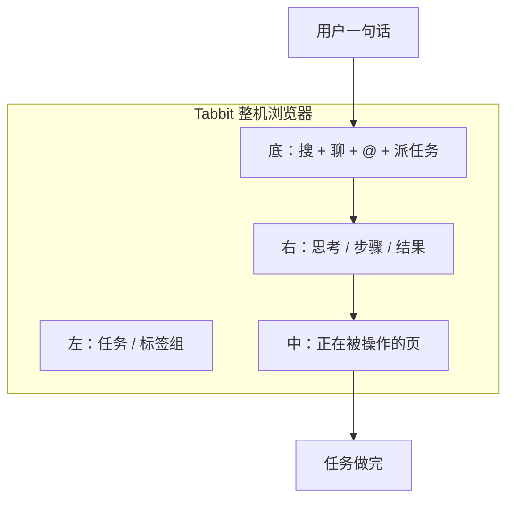

# 同一目录对标：美团 Tabbit × 持节

书的 21 章目录不变。对照物换成美团原生 AI 浏览器 Tabbit（光年之外 GN06；本机 `Tabbit Browser.app`；活跑笔记 `docs/research/tabbit-lab/NOTES.md`）。

官方定位：浏览、搜索、对话、任务执行是同一只浏览器。用户输入需求，Tabbit 操作相关标签页（以及跨软件）把任务做完。

## 角色（先说完）

```text
Tabbit = 浏览器本身 + 里面的任务 Agent
持节  = 现在挂在用户 Chrome 上的任务 Agent

要对齐的是角色，不是壳：
用户派任务 → 操作浏览器把任务做完。

不是：侧栏聊天、预印栏目、逐步审批。
活跑里 Tabbit 的「仅聊天 / 执行」闸门，持节明确不抄。
```



## 21 章：Tabbit 有什么 / 持节对应什么

| 章 | 目录 | Tabbit | 持节现在 | 角色含义 |
|---|---|---|---|---|
| 1 | 提示链 | 思考 → 导航 → 快照 → 写出标题 | `runObserveActLoop` | 多步浏览任务要接得住 |
| 2 | 路由 | 同一框：Google 搜 / 聊天 / 开任务模式 | `classifyStartOrFollowUp` | 先分清「问一句」和「去干活」 |
| 3 | 并行 | 任务标签组；多页、跨系统 | `prepareIndependentInstructionTabs` + 标签组 | 一件任务常要好几页一起开 |
| 4 | 反思 | 做完问成功/部分/未完成 | `settleProposedDone` | 做完没有，要自己停得住 |
| 5 | 工具 | 读页、抽字段、填表、跨软件 | `ActionDispatcher` / `chrome.debugger` | **这就是产品** |
| 6 | 规划 | 任务模式里按步执行 | `MissionPlan` 不预印 | 步骤是执行用的，不是栏目 |
| 7 | 多智能体 | 一只 Agent 做完 | 一只 `createLlmControlDriver` | 不要拆成聊天部和执行部 |
| 8 | 记忆 | 1.0 有记忆；`@` 引用页/组/文件 | 当轮上下文 | 任务要带着你正在看的东西 |
| 9 | 学习 | `/` 妙招、一句话生成脚本 | `saveSkill` 活路径弱 | 做过的活能再跑 |
| 10 | MCP | 兼容 Chrome 扩展；给编码 Agent 控浏览器 | 无 MCP | 持节自己就是动作面 |
| 11 | 目标 | 独立标签组里交付 | `checkCompletion` | 停手 = 任务做完 |
| 12 | 异常 | 活跑未见完整失败面 | `classifyRetry` | 做不下去要还能接着做 |
| 13 | 人机 | 仅聊天/执行、跟随中、补充信息 | 接管/跟随/取消；默认不抢页 | 人是例外，不是每步批准 |
| 14 | 检索 | `@` 当前页、组、截图、收藏、本地文件 | 当前观察；`inspect_evidence_space` | 上下文来自浏览，不是向量库 |
| 15 | A2A | 未看到智能体互雇 | 无 | 不对齐 |
| 16 | 资源 | 首页换模型 | 招呼零模型 | 换模型是壳，不是角色 |
| 17 | 推理 | 长「思考过程」 | JSON 动作；思考折页 | 思考为了下一步动作 |
| 18 | 安全 | 任务在独立标签组，不搅当前工作区 | 默认后台附着 | 干活别毁用户正在看的页 |
| 19 | 评估 | 官方任务成功率 53%→91.8%；当场评分 | `eval-matrix`；完成卡曾有分 | 度量的是任务做成没有 |
| 20 | 优先 | 左栏多组任务 | 同时一件 `start` | 先做完这一件 |
| 21 | 探索 | 全网检索、深度调研 | `search_google` | 很多任务要先找到页 |

## 持节要完成的 / 要承担的

完成的：用户派来的**浏览任务**（开页、读页、搜、填、点、跨几个来源、交出结果）。

承担的：Tabbit 里「任务模式」那一层——**操作相关标签页，把任务做完**。壳可以继续是用户日常 Chrome 上的扩展，不必先做成第二只整机浏览器。

不对齐的壳：整机 Chromium、右侧聊天栏、仅聊天/执行、默认跟随中、跨软件做 PPT。那些是 Tabbit 当浏览器厂商的范围。
