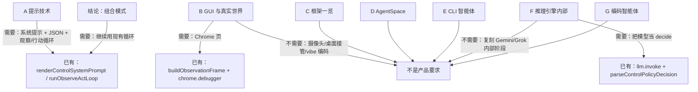

# 附录对照

持节主路径：`TaskManager.dispatch` → `createExecutorDriver` → `createLlmControlDriver`（`PERSONAL_AGENT_CORE_BACKEND = control`）→ `runObserveActLoop`。
侧栏按发生的事往下长：`pages/side-panel/src/SidePanel.tsx` + `WorkStream`。
本文件只对照附录 A–G 与书的「结论」。
不把 AgentSpace、LangGraph、CrewAI、CLI 编码助手、厂商推理引擎内部、编码智能体团队写成持节必须做的产品。

## 附录 A：高级提示技术（Advanced Prompting Techniques）

**机制**

- 系统提示给模型定规则与输出形状（「系统提示为语言模型设定整体上下文和目的」）。
- 结构化输出要机器可解析（「请求结构化输出（如 JSON…）」）。
- 页面与历史是运行时上下文，不是一次写死的提示（「上下文工程与静态系统提示不同，它动态提供…背景信息」）。
- 工具调用：模型只产出工具名与参数，宿主执行后再观察（「模型本身并不直接执行工具，而是生成结构化输出」）。
- ReAct：思考 / 行动 / 观察循环（「思考…行动…观察…循环继续」）。
- 分隔符区分指令与不可信页面（「使用分隔符…XML 标签」）。
- 书里还有 few-shot、CoT、自我一致性、思维树、APE/DSPy、Gems；那是提示方法目录，不是必须全部做成产品功能。

**持节是否需要**

- 需要：系统提示、JSON 决策、本轮页面上下文、观察→行动循环。
- 不需要：自我一致性多次投票、思维树、APE/DSPy、Google Gems、类比提示、代码提示产品。

**现有路径**

- 系统提示与 JSON 模式：`renderControlSystemPrompt` / `CONTROL_SYSTEM_PROMPT_BODY`（`chrome-extension/src/background/agent/backends/control-policy.ts`）。
- 解析：`extractJsonFromModelOutput` → `parseControlPolicyDecision`（`control-llm.ts`）。
- 循环：`runObserveActLoop`（`observe-act-loop.ts`），由 `createLlmControlDriver` 调用。
- 上下文：`buildObservationFrame` 把可见正文和可点索引包进 `<nano_untrusted_content>`（`observation.ts` + `wrapUntrustedContent`）。
- 用户那一句先分类：`TaskManager.classifyStartOrFollowUp` → `decideUserTurn` / `resolveUserTurnCheap`（`user-turn-decision.ts` 的 `SYSTEM_PROMPT` 也要求只输出 JSON）。
- `Action.prompt()` 的 When/Examples 只在 `aci-prompt.test.ts` 被调用；生产 `control` 路径不拼这套 few-shot 文本。这不是缺口，不另开提示树。

**未命中搜索**

- `self-consistency` / `tree of thought` / `DSPy` / `APE` / `Vertex AI Prompt Optimizer`：产品 `*.ts` 无命中。

**若需要则 Goal + Hard bar**

- 不改。
- 主路径已有系统提示、JSON、观察/行动循环；其余附录技法不是用户交出去一件网页事时必须看见的东西。

## 附录 B：从 GUI 到真实世界环境（AI Agentic Interactions）

**机制**

- 智能体通过界面做事：截屏或读界面、认控件、再点/打字/滚（「视觉感知…GUI 元素识别…动态执行与响应」）。
- 书举 ChatGPT Operator、Project Mariner、Claude computer use、Browser Use。
- 另一半是摄像头/麦克风对物理世界（Project Astra、Gemini Live）。
- 「vibe 编码」是写代码时的对话式协作，不是浏览器任务产品。

**持节是否需要**

- 需要：在用户 Chrome 标签里读页、点、填、开页，且默认不抢前台（`AGENTS.md`：`switchTab` / `openTab` / `navigateTo` 后台附着；`takeover` 才露出页面）。
- 不需要：像素级桌面接管、跨应用 computer-use 产品、摄像头理解房间、vibe 编码。
- 不需要做成 Operator / Mariner 的复刻。

**现有路径**

- 读页默认是 `innerText` + 可点索引，不是截屏：`normalizeVisiblePageText`（「innerText, not clickable indexes. Not a screenshot.」）+ `buildObservationFrame`。
- 点击走 `chrome.debugger`：`chrome-extension/src/background/browser/cdp/click.ts`。
- 可选截屏：`Page.takeScreenshot`（`useVision` 默认 `false`，`generalSettings.ts`）；用户要保存图时用动作 `save_screenshot`。
- 页内脚本：`evaluate` → `page.evaluate`（`ActionBuilder`）。
- 麦克风只是把语音转成输入框文字：`SpeechToTextService.transcribeAudio` + `ChatInput` 的 `onMicClick`。不是 Astra。
- 接管：侧栏 `WorkStream` 的「接管」→ `takeoverCommand`。

**未命中搜索**

- 产品 `*.ts` 无 `orca`、`computer_use`、`Project Astra`、`Gemini Live`。
- `orca` 只出现在 `AGENTS.md` / `docs/DEVLOG.md` 的约束句，不是产品功能。

**若需要则 Goal + Hard bar**

- 不改。
- 用户把「打开这个页并点第一条」交出去时，已走观察帧 + `chrome.debugger` 点击；不要为附录补一套像素桌面或摄像头。

## 附录 C：Agentic 框架快速概览

**机制**

- 目录：LangChain 线性链、LangGraph 有状态循环图、Google ADK、CrewAI、AutoGen、LlamaIndex、Haystack、MetaGPT、SuperAGI、Semantic Kernel、Strands。
- 书的选择标准是线性链 vs 循环图 vs 团队编排（「框架选择取决于应用需求」）。

**持节是否需要**

- 不需要引入或换成其中任何一个框架。
- 持节已经有自己的循环：`runObserveActLoop`。
- LangChain 只当作聊天模型 SDK，不是 LCEL/LangGraph 工作流产品。

**现有路径**

- `createChatModel`（`chrome-extension/src/background/agent/helper.ts`）用 `@langchain/openai` 等包建 `BaseChatModel`。
- `chrome-extension/package.json` 有 `@langchain/*`，没有 `@langchain/langgraph`。
- 生产后端是 `createLlmControlDriver`，不是 `PlannerAgent` / `NavigatorAgent`。
- 后者只在 `createNanoExecutorDriver` → `Executor`（旧路径）。

**未命中搜索**

- 产品代码与 `package.json`：`LangGraph`、`CrewAI`、`AutoGen`、`LlamaIndex`、`Haystack`、`MetaGPT`、`SuperAGI`、`Semantic Kernel`、`Strands`、`google.adk` 无命中。
- `CrewAI` 只出现在 `docs/research/2026-08-18-x-browser-agent-implementations.md`。

**若需要则 Goal + Hard bar**

- 不改。
- 不要为附录 C 接入 LangGraph/CrewAI/ADK。

## 附录 D：使用 AgentSpace 构建智能体

**机制**

- Google Cloud 企业平台：统一搜文档/邮件/库、无代码 Agent Designer、企业知识图谱、A2A（「名为 Agent Designer（智能体设计器）的无代码界面」）。

**持节是否需要**

- 不是产品要求。
- 持节是本机 Chrome 扩展，不是 Cloud Console 里的企业智能体工厂。

**现有路径或未命中搜索**

- 搜 `AgentSpace`、`Agent Designer`、`agentspace`：仓库无产品代码命中。
- 搜 `A2A` / `Agent2Agent`：`*.ts` / `*.json` 无命中。

**若需要则 Goal + Hard bar**

- 不改。
- 不要把 AgentSpace 画进持节架构。

## 附录 E：命令行界面中的 AI Agent

**机制**

- 终端里的编码助手：Claude Code、Gemini CLI、Aider、GitHub Copilot CLI；另有 Terminal-Bench（「AI 智能体命令行界面（CLI）」）。

**持节是否需要**

- 不是产品要求。
- 用户界面是 Chrome 侧栏，不是开发者终端结对编程。

**现有路径或未命中搜索**

- 产品 `*.ts` 无 Claude CLI / Aider / Gemini CLI / Copilot CLI / Terminal-Bench。
- `chrome-extension/scripts/action-agent-e2e.mjs` 是维护者评测脚本，不是用户 CLI 智能体。
- `CLAUDE.md` 只指向本仓库的 `AGENTS.md`。

**若需要则 Goal + Hard bar**

- 不改。
- 不要为附录 E 做终端编码产品。

## 附录 F：智能体推理引擎的内部机制

**机制**

- 向 Gemini / ChatGPT / Grok / Kimi / Claude / DeepSeek 问「你如何推理」。
- 各家自述都是：拆提示 → 检索训练模式 → 逐步组织 → 生成文本（「各模型均始于系统化解构提示」）。
- 书的落点：LLM 是智能体的中央规划器，不是要你实现某一家的内部阶段。

**持节是否需要**

- 需要：每步把用户原句 + 当前页交给模型，解析 JSON，再行动。
- 不需要：复刻任一厂商的「阶段 1–6」或把模型内部思维当产品功能。

**现有路径**

- `createLlmControlDriver` 里 `llm.invoke([SystemMessage(renderControlSystemPrompt(…)), HumanMessage(userPrompt)])`。
- 决策字段是 `observation` / `action_name` / `done`，不是 CoT 散文。
- 模型若吐 `<think>`：`removeThinkTags`（`messages/utils.ts`）剥掉后再解析。
- 侧栏「思考过程」是 `deriveWorkStream` 的 `thinking` 块，来自 `currentSummary`，不是模型思维链原文（`work-stream.ts`；文案 `chat_task_thinking_heading` = 「思考过程」）。
- 第二模型只在工人声称做完时看页：`SUPERVISE_SYSTEM_PROMPT` / `parseSuperviseVerdict`。

**未命中搜索**

- 产品代码无「解构提示 / 心智模型 / 阶段 0 输入预处理」这类厂商自述实现。

**若需要则 Goal + Hard bar**

- 不改。
- 用户看见的是侧栏里发生的事和最后一句可核对结果，不是模型内部阶段表。

## 附录 G：编码智能体

**机制**

- vibe 编码起草稿；人当编排者；脚手架 / 测试 / 文档 / 重构 / 审查等角色提示（「这些智能体不是独立的应用程序，而是…角色特定提示」）。
- 配置清单：双模型密钥、`context.toml`、`/prompts`、pre-commit 钩子。

**持节是否需要**

- 不是产品要求。
- 持节做的是用户 Chrome 里交出去的网页事，不是给本仓库写代码的团队。

**现有路径或未命中搜索**

- `evaluate` 只在当前页跑 JavaScript 取值（`evaluateActionSchema`），不是编码智能体。
- 搜 `reviewer.md`、`documenter.md`、`tester.md`、`context.toml`、`vibe`：产品树无此编码团队配置。
- `packages/storage/lib/prompt/favorites.ts` 是用户收藏的侧栏句子，不是附录 G 的角色提示库。

**若需要则 Goal + Hard bar**

- 不改。
- 不要为附录 G 在扩展里做第二套编码 Agent。

## 结论（Conclusion）

**机制**

- 21 种模式要组合，而不是单模式（「真正的力量不是来自孤立地应用单一模式」）。
- 书举研究助手：规划 + 工具 + 多智能体 + 反思 + 记忆。
- 展望：更长自主、MCP/A2A 标准化、安全与稳健。

**持节是否需要**

- 需要：继续用现有一条控制循环把读页、动作、核对、侧栏长记录组合起来。
- 不需要：按 21 章再造一套智能体市场、AgentSpace、或「智能体即服务」平台。
- MCP / A2A 作为行业标准：附录 D/结论提到它们，产品 `*.ts` 未实现；是否以后做，不属于本附录的开工项。

**现有路径**

- 组合已经发生在：`TaskManager.dispatch`（分类用户那一句）+ `runObserveActLoop`（观察/决定/行动）+ `ActionBuilder`（页上工具）+ `control-supervise.ts`（第二模型只审「做完了吗」）+ `buildObservationFrame` / `lastActionMemory`（本轮页与上一步结果）+ `WorkStream`（搜索板、打开的页、思考折叠、接管）。
- `planner.ts` / `navigator.ts` 不是这条默认路径。

**未命中搜索**

- 产品 `*.ts` / `*.json`：`MCP`、`A2A` 无命中。

**若需要则 Goal + Hard bar**

- 不改。
- 书的结论是组合已有模式；持节主路径已经是这一条。不要为「画布 / 调色板」另开框架。

## 证据

**书（已读）**

- `/tmp/agentic-design-patterns/chapters/Appendix A_ Advanced Prompting Techniques.md`
- `/tmp/agentic-design-patterns/chapters/Appendix B - AI Agentic Interactions_ From GUI to Real world environment.md`
- `/tmp/agentic-design-patterns/chapters/Appendix C - Quick overview of Agentic Frameworks.md`
- `/tmp/agentic-design-patterns/chapters/Appendix D - Building an Agent with AgentSpace (on-line only).md`
- `/tmp/agentic-design-patterns/chapters/Appendix E - AI Agents on the CLI.md`
- `/tmp/agentic-design-patterns/chapters/Appendix F  - Under the Hood_ An Inside Look at the Agents' Reasoning Engines.md`
- `/tmp/agentic-design-patterns/chapters/Appendix G -  Coding agents.md`
- `/tmp/agentic-design-patterns/chapters/Conclusion.md`

**代码搜索与命中**

- `createLlmControlDriver` / `runObserveActLoop` / `PERSONAL_AGENT_CORE_BACKEND` → `factory.ts`、`control-llm.ts`、`observe-act-loop.ts`、`personal/config.ts`
- `renderControlSystemPrompt` / `parseControlPolicyDecision` → `control-policy.ts`
- `buildObservationFrame` / `wrapUntrustedContent` / `chrome.debugger` → `observation.ts`、`messages/utils.ts`、`cdp/click.ts`
- `classifyStartOrFollowUp` / `decideUserTurn` → `task/manager.ts`、`intent/user-turn-decision.ts`
- `@langchain/*` → `chrome-extension/package.json`、`helper.ts`（ChatModel 包装）
- 侧栏思考折叠 → `pages/side-panel/src/presentation/work-stream.ts`、`WorkStream.tsx`

**明确未命中（产品目录，不含研究笔记里的点名）**

- `AgentSpace`、`Agent Designer`、`LangGraph`、`CrewAI`、`AutoGen`、`DSPy`、`self-consistency`、`tree of thought`、`Terminal-Bench`、`Aider`、`Gemini CLI`、`Copilot CLI`、`A2A`、`MCP`、`orca`（`*.ts`）
