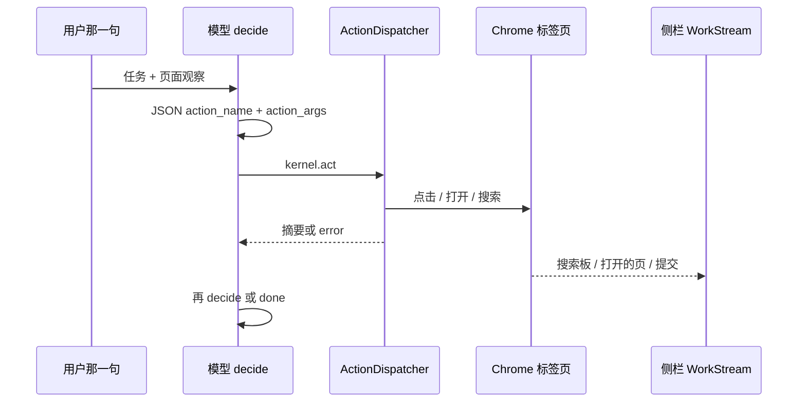

# 第 5 章：工具使用（Tool Use）

## 书里的机制

- 向模型登记外部能力：名称、用途、参数类型和说明。（「向 LLM 定义并描述外部函数或能力」）
- 模型读用户请求和工具表，决定要不要调用、调用哪一个。（「LLM 决定是否需要调用一个或多个工具」）
- 模型产出结构化调用，通常是 JSON：工具名 + 参数。（「生成结构化输出（通常是 JSON 对象）」）
- 编排层截下这份结构，在模型外执行真实函数。（「智能体框架或编排层拦截此结构化输出」）
- 执行结果回到智能体，作为下一轮上下文。（「工具执行的输出或结果返回给智能体」）
- 模型用结果写给用户，或再选下一个工具。（「使用它向用户制定最终响应或决定工作流中的下一步」）
- 书里的例子还包括搜索、沙盒跑代码、发邮件、查库、天气/股价 API。（「从外部源检索信息」「执行代码」「发送通信」）

## 结论

- 部分做成
- 完成度：82
- 一句话：`createLlmControlDriver` 经 `parseControlPolicyDecision` 读出动作名、经 `createBrowserKernel.act` 和 `ActionDispatcher.dispatch` 在模型外执行，结果能回到下一轮 `decide`；但 `Action.prompt()` 没有进入 control 系统提示词，生产路径也没有 `bindTools`。

## 对照表

| 书中机制 | 持节路径与符号 | present / partial / absent | 用户能看见什么 |
|---|---|---|---|
| 向 LLM 定义工具（名称、用途、参数） | `chrome-extension/src/background/agent/actions/schemas.ts` `ActionSchema`（`name` / `description` / `whenToUse` / Zod `schema`）；`builder.ts` `Action.prompt()` 能拼出 ACI 文本；生产 control 只把名字写进 `control-policy.ts` `CONTROL_SYSTEM_PROMPT_BODY`，`Action.prompt()` 仅出现在 `actions/__tests__/aci-prompt.test.ts` | partial | 用户看不到工具表。侧栏不展示 `click_element` 这种英文名（`activity-stream.ts` `looksLikeActionName`） |
| LLM 决定是否调用工具 | `control-llm.ts` `createLlmControlDriver` 的 `decide`：`llm.invoke` → `extractJsonFromModelOutput` → `parseControlPolicyDecision`；无动作时 `unknown_action` / `no_action` | present | 侧栏出现思考折页或「正在搜索 / 打开的页」之前，用户先看到任务在跑（`WorkStream.tsx` `task-thinking-process`） |
| 生成结构化工具调用（JSON 名称+参数） | `control-policy.ts` `parseAction`：`action_name`+`action_args`，或 `{ action: { name, args } }`；`ALLOWED_ACTIONS` 白名单 | present | 用户看不到 JSON。失败时任务可能停在 `json_parse_failed`（`observe-act-loop.ts` `LoopFailureCategory`） |
| 编排层在模型外执行 | `browser-kernel.ts` `createBrowserKernel.act` → `TaskManager.executorHooks.dispatchAction` → `ActionDispatcher.dispatch` → `Action.executeParsed`；点击落到 `page.ts` `clickElementNode` → `cdp/click.ts` `clickCdpElement`（`chrome.debugger`） | present | `attempt-display.ts` `buildAttemptDisplaySummary` 写出「打开 etsy.com」「搜索：…」「点击页面控件」；提交类出现「下一步要提交或确认 / 已提交或确认」（`WorkStream.tsx`） |
| 工具结果返回模型再决定下一步 | `runObserveActLoop` 成功后 `reobserve`；`control-llm.ts` `shouldKeepActionResultInContext` 把部分结果写入 `lastActionMemory`，`buildControlUserPrompt` 包进 `<last_action_result>`；`maxActionsPerStep: 1`，一轮一个动作 | partial | 搜索板「正在搜索 / 已完成网页搜索」和页面卡片会往下长；`observe` / `evaluate` / `wait` / `read_page_text` 被 `work-stream.ts` `HIDDEN_ACTIONS` 藏掉 |
| 原生函数调用（LangChain `bindTools` / `create_tool_calling_agent`） | 在 `chrome-extension/`、`pages/` 搜 `bindTools`、`create_tool_calling_agent` 无命中。`withStructuredOutput` / `tool_calls` 只在 `agents/base.ts` `setWithStructuredOutput` 和 `agents/navigator.ts`；`factory.ts` 生产默认走 `createLlmControlDriver`，不 `new Executor` | absent | `packages/i18n/` 与 `pages/side-panel/` 搜「函数调用」无设置文案。用户只看到搜索板 / 打开的页 / 提交说明 |
| 从外部源检索（书里的天气/搜索工具） | `schemas.ts` `searchGoogleActionSchema`；`builder.ts` `searchGoogle` → `browserContext.navigateTo` Google SERP + `collectSearchFindings` | present | 侧栏搜索板显示查询词和结果标题（`WorkStream.tsx` `task-search-board` / `task-search-hits`）；摘要「已在 Google 上搜寻 …」（`zh_CN` `act_searchGoogle_ok`） |
| 安全环境执行代码（书里的沙盒 Python） | `schemas.ts` `evaluateActionSchema`；`builder.ts` `evaluate` 调 `page.evaluate(input.code)`，在当前标签页跑 JS，不是沙盒解释器 | partial | `evaluate` 在 `HIDDEN_ACTIONS` 里，侧栏不长一块。算错或脚本抛错时，用户只看到任务继续或失败，看不到「代码执行器」 |
| 发邮件 / 天气 API / 股价 API / 查库付款 | 在 `chrome-extension/`、`pages/` 搜 `send_email`、`sendEmail`、`smtp`、`get_stock`、`inventory`、`processPayment`、`BuiltInCodeExecutor`、`VSearchAgent`、`Vertex` 无命中。`weather` 只出现在 i18n 占位例句 `"weather today"`；`actions/` 下无 `inventory` / `database` | absent | 用户不能把「给 John 发邮件」「伦敦天气」「AAPL 股价」交给一个专用接口；只能让模型用 `search_google` / `go_to_url` 打开网页 |

## 对持节业务的意义

用户把页面上的事交出去之后，这一章对应的是：模型能不能点名一个动作、扩展在 Chrome 里跑完、侧栏按发生的事往下长。
做成的部分已经决定主路径：`TaskManager.dispatch` → `createExecutorDriver` → `createLlmControlDriver` → `runObserveActLoop`。
用户能碰到的成功样子是搜索板、打开的页、提交说明，以及最后一句可核对的结果。
缺口会在失败时露出来：模型不知道 `Action.prompt()` 里的「何时不要用」，可能乱填参数；`Action.parse` / 点击失败的文字不一定进 `<last_action_result>`（`shouldKeepActionResultInContext` 不含 `click_element` / `go_to_url`）。
书里的邮件、天气、股价、沙盒 Python 不是持节要补的第二套工具树；持节的外部世界是当前标签页。

## 完成方案

- Goal: control 系统提示词带上已注册动作的 `Action.prompt()` 文本；任意动作的 `error` 或 `summary` 都进入下一轮 `<last_action_result>`。
- Hard bar: 当我交「点页面上的提交」时，发给模型的 system 消息含 `click_element` 的 `When to use:` 和 `Do NOT use when:`；当模型少传 `index` 和 `query` 时，下一轮 `HumanMessage` 的 `<last_action_result>` 里能看到 `Action.parse` 抛出的 `InvalidInputError` 原文。
- 改哪些现有文件（不要新开第二套 agent 树）
  - `chrome-extension/src/background/agent/backends/control-policy.ts`：`renderControlSystemPrompt` 拼入 registry 的 `Action.prompt()`，不要手写第二份动作说明。
  - `chrome-extension/src/background/agent/backends/control-llm.ts`：`act` 在失败时也写 `lastActionMemory`，不要只对 `CONTENT_RESULT_ACTIONS` 保留结果。
  - 可选核对：`chrome-extension/src/background/agent/backends/__tests__/control-llm-prompt.test.ts`、`control-policy.test.ts`。
- 非目标:
  - 不把 `agents/navigator.ts` / `executor.ts` 接回 `factory.ts`。
  - 不引入 `bindTools`（`base.ts` `setWithStructuredOutput` 已对 MiniMax 关掉结构化输出）。
  - 不加天气、邮件、股价、Vertex 搜索、Python 沙盒。
  - 不把 `evaluate` 从 `HIDDEN_ACTIONS` 里拿出来当新栏目。

## 证据

- 书：`/tmp/agentic-design-patterns/chapters/Chapter 5_ Tool Use.md`
- 代码：用过的搜索词和命中路径
  - `createExecutorDriver` / `createLlmControlDriver` / `PERSONAL_AGENT_CORE_BACKEND` → `factory.ts`、`personal/config.ts`（值为 `'control'`）、`control-llm.ts`
  - `runObserveActLoop` → `observe-act-loop.ts`
  - `ActionBuilder` / `buildDefaultActions` / `Action.prompt` / `buildDynamicActionSchema` → `actions/builder.ts`、`actions/schemas.ts`
  - `parseControlPolicyDecision` / `CONTROL_SYSTEM_PROMPT_BODY` / `ALLOWED_ACTIONS` → `control-policy.ts`
  - `dispatchAction` / `ActionDispatcher.dispatch` / `decideEffect` → `task/manager.ts`、`task/action-dispatcher.ts`
  - `createBrowserKernel` / `act` → `browser/kernel/browser-kernel.ts`
  - `clickCdpElement` → `browser/cdp/click.ts`、`browser/page.ts` `clickElementNode`
  - `deriveWorkStream` / `HIDDEN_ACTIONS` / `isSearchAttempt` → `pages/side-panel/src/presentation/work-stream.ts`、`components/WorkStream.tsx`
  - `buildAttemptDisplaySummary` → `task/attempt-display.ts`
  - `withStructuredOutput` / `tool_calls` → `agents/base.ts`、`agents/navigator.ts`（仅 `executor.ts` `new Executor` 使用；`factory.ts` 的 control 分支不调用）
- 明确的未命中：
  - `bindTools` / `create_tool_calling_agent`：`chrome-extension/`、`pages/` 无命中
  - `send_email` / `sendEmail` / `smtp`：`chrome-extension/`、`pages/` 无命中
  - `get_stock` / `股价`：`chrome-extension/`、`pages/` 无命中
  - `inventory` / `processPayment` / `database`：`chrome-extension/src/background/agent/actions/` 无命中
  - `BuiltInCodeExecutor` / `VSearchAgent` / `Vertex` / `google_search`（ADK 符号，不是 `search_google`）：`chrome-extension/`、`pages/` 无命中
  - `weather`：只在 `packages/i18n/locales/*/messages.json` 的 `act_searchGoogle_*` 占位例句 `"weather today"`；`chrome-extension/src` 与 `pages/side-panel/src` 无天气 API
  - 「函数调用」：`packages/i18n/`、`pages/side-panel/` 无设置文案
