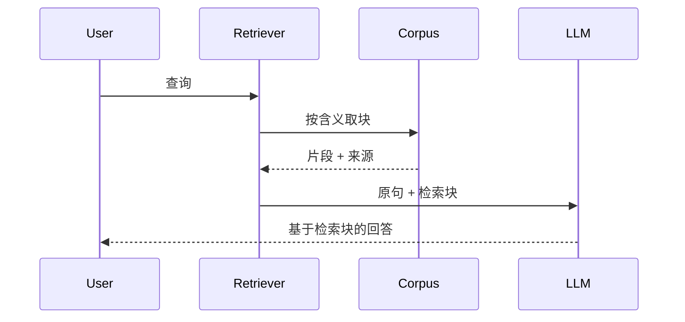

# 第 14 章：知识检索（RAG）（Knowledge Retrieval (RAG)）

## 书里的机制

- 用户那一句不先直接进模型；系统先在外部知识库里找相关片段，再把片段补进提示，最后才生成。（「查询不会直接发送给 LLM。相反，系统首先在一个庞大的外部知识库……中搜索相关信息」）
- 检索按含义找近邻，不靠字面重合：文本先变成嵌入向量，再用语义距离取块。（「嵌入是文本的数值表示形式」「语义搜索依赖于查找与用户查询语义距离最小的文档」）
- 大文档要先分块，再对块做向量搜索、BM25 或二者混合。（「分块是将大型文档分解为更小……片段」「主要方法是向量搜索」「另一种……是 BM25」「通常使用混合搜索」）
- 嵌入存在向量数据库里，按含义查询，而不是只搜单词。（「向量数据库是一种专门设计用于高效存储和查询嵌入的专用数据库」）
- 答案要能指回检索来源，降低编造。（「能够提供"引用"，即明确指出信息的来源」）
- 书把 Google Search 工具也算一种检索：搜到的结果用来垫住模型，而不是只让模型背训练数据。（「如何使用 Google Search 进行 RAG」「Google Search 工具是内置检索机制的直接示例」）
- GraphRAG 在知识图谱上沿实体关系走，用来拼分散在多份文档里的事实。（「利用知识图谱而不是简单的向量数据库」「综合来自多个文档的碎片化信息」）
- Agentic RAG 多一层判断：核来源新旧、解冲突、拆子查询、知识不够再调外部工具。（「主动质疑其质量、相关性和完整性」「识别这种矛盾」「分解为单独的子查询」「识别知识差距并使用外部工具」）

持节默认循环不是上图。
`createExecutorDriver` → `createLlmControlDriver` → `runObserveActLoop` 每步先 `observeFrame` / `buildObservationFrame` 读当前标签页，再 `buildControlUserPrompt`。
当前页正文进模型，不等于对一份已存语料做检索。

## 结论

- 部分做成
- 完成度：22
- 一句话：生产路径 `createLlmControlDriver` → `buildControlUserPrompt` 默认塞的是 `buildObservationFrame` 的「Visible page text」，不是检索器；唯一对着已存记录检索并写回模型的是 `ActionBuilder` 里的 `inspectEvidenceSpace`，经 `shouldKeepActionResultInContext('inspect_evidence_space')` 放进 `<last_action_result>`，过滤是 `String.includes`，仓库里没有 embedding / 向量检索函数。

## 对照表

| 书中机制 | 持节路径与符号 | present / partial / absent | 用户能看见什么 |
|---|---|---|---|
| 查询先检索知识库，把片段增强进提示再生成 | `chrome-extension/src/background/agent/backends/control-llm.ts` 的 `buildControlUserPrompt`、`shouldKeepActionResultInContext`；默认上下文是同文件 `renderObservationForModel` ← `buildObservationFrame`（`chrome-extension/src/background/browser/kernel/observation.ts`）。没有在 `decide` 前自动检索语料的函数。 | partial | 日常任务侧栏长的是当前打开的页和模型那句结果。模型不必先检索已存记录。调研任务里若模型调用了 `inspect_evidence_space`，该动作在 `pages/side-panel/src/presentation/work-stream.ts` 的 `HIDDEN_ACTIONS` 里，侧栏不画出「检索证据」这一步。 |
| 对已存储语料的检索器（检索后写入模型上下文） | `packages/storage/lib/task/evidence-space.ts` 的 `addEvidenceRecords` / `getEvidenceSpace`（键 `task-evidence-space-v1`）；`chrome-extension/src/background/agent/actions/builder.ts` 的 `inspectEvidenceSpace`；`inspectEvidenceSpaceActionSchema`（`schemas.ts`）。过滤：`recordType` 相等，再把 title/observation 等拼成小写字符串做 `.includes(query)`。命中页经 `ActionResult.extractedContent` → `lastActionMemory` → `<last_action_result>`。 | partial | 用户看不见检索句。`record_evidence` / `inspect_evidence_space` 都被 `HIDDEN_ACTIONS` 藏掉。`deriveTaskProgressView`（`task-progress-view.ts`）只用 `evidenceSpace` 算健康时间，不把记录列表画出来。 |
| 嵌入、语义距离、向量数据库 | 无对应符号。 | absent | 无。搜 `embedding` / `vectorstore` / `weaviate` / `pinecone` / `chroma` / `faiss` / `pgvector` / `cosine` / `OpenAIEmbeddings` / `BM25` / `similarity_top`：`chrome-extension/`、`packages/`、`pages/`、各 `package.json` 无产品命中。`embedding` 仅 `022-privacy-gate.test.ts` 里「without embedding cookie」这句测试说明。 |
| 文档分块后再检索 | 无对应符号。`compactStateText` / `compressTrajectory`（`chrome-extension/src/background/agent/context.ts`）是把当前观察和轨迹截短，不是把语料切成可检索块。`manager.ts` 里的 `chunks` 是改写 URL 字符串。 | absent | 无。搜 `CharacterTextSplitter` / `chunk_overlap` / `split_documents`：仓库无命中。 |
| 网页搜索当作检索器（书里 Google Search 例） | `ActionBuilder` 的 `searchGoogle`：`navigateTo('https://www.google.com/search?q=…')`，再 `collectSearchFindings`（`chrome-extension/src/background/browser/search-results.ts` 的 `readSearchResultsInPage`）。`search_google` 不在 `CONTENT_RESULT_ACTIONS`，标题列表不进 `lastActionMemory`。下一轮模型看到的是搜索页的 `Visible page text`。`control-llm.ts` 在 `isSearchResultsUrl` 为真时也会 `collectSearchFindings`，交给 `openAndDescribeIndependentPages` 开页，仍不是「检索块写入提示」。 | partial | 侧栏 `WorkStream`（`pages/side-panel/src/components/WorkStream.tsx`）搜索板文案：「正在搜索」或「已完成网页搜索」，下列标题/主机；`attempt-display.ts` 的 `search_google` 显示「搜索：{query}」。这是打开 Google 再看页，不是检索器把片段垫进提示。 |
| 当前页抽取 / 再读（书要求的「外部知识库检索」不是这个） | `runExtractContent`（`extract-content.ts`）；`readPageText`（`builder.ts`，读 `document.body.innerText`）；`buildObservationFrame` 的 `Visible page text`。`CONTROL_SYSTEM_PROMPT` 规则 14、16 明确叫模型读当前页或 `extract_content`。 | absent | 侧栏可出现「抽取：{goal}」或「抽出的内容」（`attempt-display.ts` / `work-stream.ts`）。这是读正在看的页，不是对已存语料检索。 |
| 回答可归因到检索来源 | `EvidenceRecord.source` / `canonicalSource`（`evidence-space.ts`）；`TaskArtifact.sources` 的 `retrievedAt`（`artifact.ts`，`runExtractContent` 写入当前页 URL）；`formatVerifiedPagesForPrompt`（`verified-step-records.ts`）只拼 `url=` 和 `title=`，不用 `quote`。`collectStreamSources` 从搜索命中和打开的页收 URL，交给 `AnswerProse`。 | partial | 完成后结果句下可列出本次打开过的页和搜索标题链接。没有「第 N 条来自检索块 X」的引用格式。证据记录的 `source` 不自动出现在结果句下。 |
| GraphRAG（知识图谱上沿边检索） | 无对应符号。 | absent | 无。搜 `GraphRAG` / `knowledge graph` / `entity`+`relation`：`chrome-extension/`、`packages/`、`pages/` 无命中。`contradictions` 只是 `recordResearchDecision` 里存的字符串数组，不是图上的边。 |
| Agentic RAG：核来源、解冲突、拆子查询、缺口再搜 | `instructionLooksLikeResearch` 为真时才附加 `CONTROL_RESEARCH_PROMPT_BODY`（`control-policy.ts` R1–R6）。R1 禁止把搜索摘要当证据。`recordEvidence` 用 `evidenceBasisAppearsInPage` / `resolveProductEvidenceBasis`（词重叠，不是嵌入）核对原文在不在当前页。`contradictions` 只写入 `ResearchDecision`，没有按权威源选一条再检索的函数。没有把一个比较题拆成多次语料检索的节点。 | partial | 普通打开/点击任务系统提示里没有 `record_evidence`（`control-policy.test.ts` 断言「打开 YouTube…」不加调研脚本）。调研任务用户仍看不到核源/解冲突步骤（同属 `HIDDEN_ACTIONS`）。搜到摘要当证据会被拒，用户侧栏不展示拒因。 |

## 对持节业务的意义

持节业务 = 用户把页面上的事交出去，侧栏按发生的事往下长，交出能核对的结果。

普通一句「打开这个、点那个、这页是什么」不需要 RAG：`buildObservationFrame` 已经把当前页正文交给模型。
缺的是离开源页之后，或跨多次搜索之后，已记下的句子不会自动回到下一轮 `buildControlUserPrompt`。
用户若交出去的是调研（「至少 N 条用户讨论」），模型必须自己再调 `inspect_evidence_space`；忘掉或调成空查询时，侧栏仍只看到搜索板和打开的页，看不到「根据第 3 条记录」这种可对账引用。
失败场景：记过一条 Reddit 原话后去了产品页，再问「刚才那条用户原话是什么」，模型面前只有新产品页的 `Visible page text`，会重编或再搜；用户在结果句下对不上那条 URL。
搜索板（「已完成网页搜索」）只证明打开过 Google，不证明检索块进了提示。

## 完成方案

- Goal: 当本任务的 `EvidenceSpace.records` 非空时，`createLlmControlDriver` 的每一次 `decide` 都先按用户原句取出相关记录（来源 URL + 原文/观察），写入 `buildControlUserPrompt`，不必碰运气等模型调用 `inspect_evidence_space`。结果句能带上这些 URL。
- Hard bar: 先在页 A 用 `record_evidence` 写下一条 `raw_basis`，再打开无关页 B，补一句「刚才记下的用户原话是什么」。下一轮发给模型的 user 提示里必须出现那条 `raw_basis` 和页 A 的 URL；侧栏结果下列出该 URL。模型不调用 `inspect_evidence_space` 也要成立。
- 改哪些现有文件（不要新开第二套 agent 树）
  - `packages/storage/lib/task/evidence-space.ts`：加一个按查询过滤/打分的纯函数（可复用已有 `searchableEvidenceText`），不要上向量库。
  - `chrome-extension/src/background/agent/backends/control-llm.ts`：在 `buildControlUserPrompt` / `decide` 里注入检索块；默认观察仍走 `buildObservationFrame`。
  - `chrome-extension/src/background/agent/backends/control-policy.ts`：写明回答必须点回检索到的 `source`。
  - `pages/side-panel/src/presentation/work-stream.ts` 与 `TaskStatusCard.tsx`：`collectStreamSources` 把本次用到的证据 `source` 算进结果下列表。
- 非目标: 不引入 Pinecone / Weaviate / 嵌入模型；不做 GraphRAG；不替换 `runObserveActLoop`；不把当前页观察改名叫检索。

## 证据

- 书：`/tmp/agentic-design-patterns/chapters/Chapter 14_ Knowledge Retrieval (RAG).md`
- 代码：用过的搜索词和命中路径
  - `search_google` / `collectSearchFindings` → `builder.ts` `searchGoogle`；`search-results.ts` `isSearchResultsUrl`、`readSearchResultsInPage`、`collectSearchFindings`；`control-llm.ts` 观察搜索页时开独立页
  - `inspect_evidence_space` / `record_evidence` / `getEvidenceSpace` → `schemas.ts`；`builder.ts` `recordEvidence`、`inspectEvidenceSpace`；`packages/storage/lib/task/evidence-space.ts`
  - `extract_content` / `runExtractContent` → `extract-content.ts`（当前页表格，不是语料检索）
  - `buildControlUserPrompt` / `shouldKeepActionResultInContext` / `CONTENT_RESULT_ACTIONS` → `control-llm.ts`
  - `buildObservationFrame` / `Visible page text` → `observation.ts`
  - `instructionLooksLikeResearch` / `CONTROL_RESEARCH_PROMPT_BODY` → `control-policy.ts`
  - `HIDDEN_ACTIONS` / `deriveWorkStream` / `collectStreamSources` → `work-stream.ts`；`WorkStream.tsx` 搜索板
  - `formatVerifiedPagesForPrompt` → `verified-step-records.ts`
  - `createExecutorDriver` / `PERSONAL_AGENT_CORE_BACKEND = 'control'` → `factory.ts`、`personal/config.ts`
- 明确的未命中
  - `RAG`、`ragCorpus`、`retriever`、`vectorstore`、`weaviate`、`pinecone`、`chroma`、`qdrant`、`milvus`、`faiss`、`pgvector`、`BM25`、`OpenAIEmbeddings`、`cosine`、`similarity_top`、`GraphRAG`、`knowledge graph`：在 `chrome-extension/`、`packages/`、`pages/` 及各 `package.json` 无产品实现
  - `embedding`：无嵌入函数；仅测试文案「without embedding cookie/password/api keys」（`chrome-extension/src/background/task/__tests__/022-privacy-gate.test.ts`）
  - 不存在跨任务、可语义查询的知识库；`task-evidence-space-v1` 按 `taskId` 分桶，检索只在模型调用 `inspect_evidence_space` 时发生
