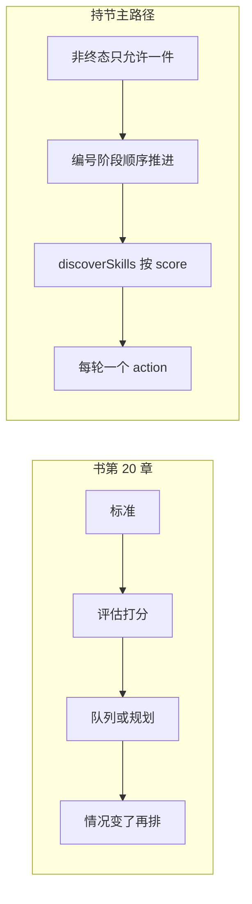

# 第 20 章：优先级排序（Prioritization）

## 书里的机制

- 智能体面对大量潜在行动、相互冲突的目标和有限资源时，必须先决定下一步做什么，否则会拖住关键目标（「根据重要性、紧迫性、依赖关系和既定标准来评估和排序任务、目标或行动」）。
- 先写评估标准：紧急性、重要性、依赖关系、资源是否就绪、成本/收益、用户偏好（「首先是**标准定义**，即建立任务评估的规则或指标」）。
- 再按标准评估每一项，可以是规则，也可以是模型打分（「其次是**任务评估**……评估方法可以从简单规则到大语言模型的复杂评分或推理」）。
- 评估之后用队列或规划组件选出下一步或一段序列（「第三是**调度或选择逻辑**……可能使用队列或高级规划组件」）。
- 情况变了要重排，例如新的关键事件或截止日期临近（「最后是**动态重新优先级排序**」）。
- 同一套机制分三层：选总体目标、在计划里排步骤、从当前可选项里选即时行动（「选择总体目标（高层次目标优先级排序）、在计划内排序步骤（子任务优先级排序）或从可用选项中选择下一个即时行动（行动选择）」）。
- 书中代码把任务标成 P0 / P1 / P2，并用 `assign_priority_to_task` 写入（「优先级级别：P0（最高）、P1（中等）、P2（最低）」）。
- 适用条件是资源约束下同时管多件相互冲突的事（「必须在资源约束下自主管理多个（通常是相互冲突的）任务或目标」）。

## 结论

- 部分做成
- 完成度：32
- 一句话：`discoverSkills` 会按 `match.score` 排技能，`advanceWhileActivePhaseCriteriaMet` 会按用户写的 1) 2) 3) 顺序推进阶段，研究回执里也有 `whyNow` / `deferred`；但 `TaskSession` / `MissionPhase` 没有优先级字段，第二件独立 `start` 被 `TaskManager.dispatchNow` 直接拒绝，仓库里也没有按紧急度重排多件事的函数。

## 对照表

| 书中机制 | 持节路径与符号 | present / partial / absent | 用户能看见什么 |
|---|---|---|---|
| 标准定义（紧急性、重要性、依赖、资源、成本、用户偏好） | `packages/storage/lib/task/evidence-space.ts` 的 `EvidencePriority`；`chrome-extension/src/background/agent/actions/schemas.ts` 的 `why_now` / `why_others_later`；`MissionPhase` / `TaskSession` 无 priority 字段 | partial | 研究任务验收飞书表必须出现「优先级」列（`REQUIRED_RESEARCH_TABLE_FIELDS`）。日常侧栏任务卡没有紧急度。 |
| 任务评估（规则或模型打分后排序） | `chrome-extension/src/background/agent/skills/discovery.ts` 的 `discoverSkills`：`candidates.sort((left, right) => right.score - left.score)`。`inspectEvidenceSpace`（`builder.ts`）回给模型的记录不含 `priority` | partial | 用户看不见分数。原子技能命中时侧栏只看到随后发生的打开/点击。 |
| 调度或选择下一步 | `TaskManager.dispatchNow` 拒绝第二件非终态 `start`；`runObserveActLoop` 每轮消费一个 `LoopDecision`；`parseControlPolicyDecision` 只解析一个 `action`；控制提示写「One action per turn」「prefer the smallest step」 | partial | 侧栏进度把 `status === 'active'` 的阶段标成「当前阶段」。另开一件还在跑的任务时，侧栏写「这个操作已经失效，请按当前状态继续。」（`chat_task_command_invalid_transition`） |
| 动态重新优先级排序 | 搜 `assign_priority`、`urgency`、`priorityQueue`、`repriorit`：`chrome-extension/`、`packages/`、`pages/` 均无命中。`TaskManager.followUp` 只 `driver.addFollowUp`；`createLlmControlDriver` 把追问拼进同一条 `instruction` | absent | 用户改方向时侧栏写「用户已调整任务方向，新要求已进入后续执行」（`latestDirectionChange`）。阶段列表不会按紧急度重排。 |
| 高层次目标优先级（多件用户任务比谁先做） | `packages/storage/lib/task/runtime.ts` 的 `getActiveTask` 按 `updatedAt` 取最新非终态任务，不是按优先级。`TaskManager.dispatchNow`：`active && !TERMINAL_STATUSES.includes(active.status)` 则 `invalid_transition`。测试：`rejects a second concurrent task` | absent | 同一时间只能有一件进行中的事。第二件独立委托进不去队列。 |
| 计划内步骤排序 | `refineMissionPlanFromInstruction` / `numberedStepSegments` 按用户编号切阶段；`advanceWhileActivePhaseCriteriaMet` 只把当前阶段标 `done` 再 `markActivePhase(..., activeIndex + 1)`。`CONTROL_SYSTEM_PROMPT_BODY` 规则 12：「Finish current-phase evidence before advancing」 | partial | 用户写「1) … 2) …」时侧栏出现「阶段 1 / 阶段 2」，当前行写「当前阶段」，做完写「已通过」。 |
| 即时行动选择 | `SkillRuntime.tryDecide` 按 `discoverSkills` 分数依次 `skill.run`；未处理再走 `createLlmControlDriver` 的 LLM JSON。`decideUserTurn` / `resolveUserTurnCheap` 只分类 reply/clarify/execute/stop，不给任务打分 | partial | 「打开 YouTube 并点击第一个视频」可走站点技能，侧栏出现打开/点击。长句或链式要求技能不接，继续观察-决定。闲聊不会开任务。 |
| 书中 P0/P1/P2 任务队列与 `assign_priority_to_task` | 搜 `assign_priority`、`P0`/`P1`/`P2` 作为任务字段：`TaskSession` / `MissionPhase` 无此字段。代码里的 P0/P1 是产品票注释（如 `page-state.ts`「product/007 P0」），不是调度等级 | absent | 用户不能给一件委托标 P0，也不能看到待办按 P0→P2 排列。 |

## 对持节业务的意义

持节业务是：用户把页面上的事交出去，侧栏按发生的事往下长，最后交出能核对的那句话。

这一章要改的是「两件事同时成立时先做哪件」，不是再画一张优先级看板。

用户正在跑「打开 YouTube」时又交「先回这封紧急邮件」：现在不是重排，而是第二件 `start` 被拒，或同一会话 `follow_up` 把新句子拼进当前指令；侧栏仍只有一条「当前阶段」。

研究任务里模型会写 `why_now` / `deferred`，飞书决策文档要能读到「下一步做什么 / 为什么 / 暂时不做」；`work-stream.ts` 把 `record_research_decision` 藏进 `HIDDEN_ACTIONS`，侧栏时间线不展示这次取舍。

失败场景是：用户写了 1) 打开视频 2) 填表付款，模型按书写顺序先耗在视频上，付款一直停在 `planned`；用户只能再发一句改方向，系统不会自己把付款提前。

## 完成方案

- Goal: 同一件委托里，当用户编号步骤、后来的追问、或证据 `priority` 互相冲突时，用现有 `MissionPlan` 标出此刻该做哪一阶段；侧栏「当前阶段」跟这次选择走。
- Hard bar: 用户先说「1) 打开 YouTube 2) 填当前这张表」，阶段 1 已是 `active`；再说「先填表，视频往后」。`markActivePhase(plan, 1, now)` 把阶段 2 标成 `active`、阶段 1 回到 `planned`；侧栏「当前阶段」出现在「阶段 2」。另开聊天再 `start` 一件无关的事，仍因已有非终态任务被拒绝。
- 改哪些现有文件（不要新开第二套 agent 树）
  - `chrome-extension/src/background/task/mission-plan.ts`：追问可以指定当前阶段，不要只能 `activeIndex + 1`。
  - `chrome-extension/src/background/task/manager.ts`：`followUp` / `direction_change` 写回计划，不只 `addFollowUp` 拼句子。
  - `chrome-extension/src/background/agent/backends/control-policy.ts`：提示跟 `active_phase` 走；不要发明第二套任务队列。
  - `chrome-extension/src/background/agent/actions/builder.ts`：`inspectEvidenceSpace` 把已存的 `priority` 还给模型，需要时按 high → low 排列。
  - `pages/side-panel/src/presentation/task-progress-view.ts`：继续用 `phase.status === 'active'` 画「当前阶段」，不要新栏目。
- 非目标: 多任务 P0/P1/P2 面板；取消「同时只跑一件」；`planner.ts` / `navigator.ts` 旧路径；第二套 agent。

## 证据

- 书：`/tmp/agentic-design-patterns/chapters/Chapter 20_ Prioritization.md`
- 代码：用过的搜索词和命中路径
  - `priority` → `evidence-space.ts`（`EvidencePriority`）、`schemas.ts`（`priority` / `why_now`）、`builder.ts`（写入记录）、`control-policy.ts`（研究提示 R2）
  - `score` / `discoverSkills` / `topK` → `discovery.ts`、`runtime.ts`、`skills/types.ts`
  - `getActiveTask` / `invalid_transition` / `rejects a second concurrent task` → `runtime.ts`、`manager.ts`、`manager.test.ts`
  - `advanceMissionPhase` / `markActivePhase` / `numberedStepSegments` → `mission-plan.ts`
  - `why_now` / `deferred` / `为什么 competing` → `schemas.ts`、`builder.ts` 的 `recordResearchDecision`、`evidence-space.ts` 的 `validateResearchDecision`
  - `follow_up` / `direction_change` / `addFollowUp` → `manager.ts`、`control-llm.ts`、`SidePanel.tsx`、`task-progress-view.ts`
  - `createLlmControlDriver` / `PERSONAL_AGENT_CORE_BACKEND` → `factory.ts`、`personal/config.ts`（生产默认 `control`）
- 明确的未命中
  - `assign_priority`、`priorityQueue`、`taskQueue`、`repriorit`、`urgency`：`chrome-extension/`、`packages/`、`pages/` 无命中
  - `TaskSession.priority` / `MissionPhase.priority`：`packages/storage/lib/task/types.ts` 无此字段
  - `inspectEvidenceSpace` 映射记录：`builder.ts` 返回 id/type/source/title/observation/inference/stance/relatedProduct/livingReaderCapability，不含 `priority`
  - `pages/side-panel/src` 除测试夹具外无 `priority` 展示
