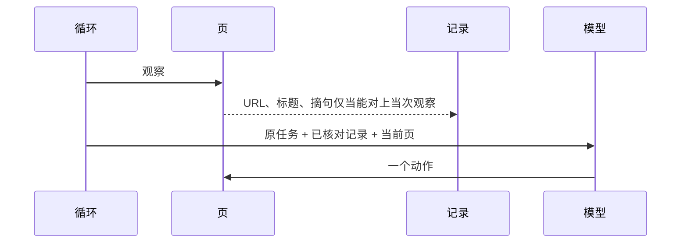

# 段记录：页上核对过的 URL、标题、摘句交给下一步

日期：2026-08-19  
状态：已实现（合入工作区）  
产品：持节。生产路径仍是 `createLlmControlDriver` + `runObserveActLoop`。不要请回 `Executor` 规划器 / 导航器。

## 场景

用户交：`1) 打开 IANA 首页 2) 打开英文维基 Web_browser 3) 写出两个页面的标题`

第一段做成后，当前标签是 `https://www.iana.org`，页标题是 `Internet Assigned Numbers Authority`。

下一轮模型必须能读到一份**已经核对过的记录**，而不是只靠整句原任务和一句 `lastActionMemory`。

第三段交出来的那句话里，必须出现这两页核对过的标题。只停在维基 URL 上、标题是编的，不能收工。

## 现在

每一轮塞给模型的是：整句 `Task`、当前页、`lastActionMemory` 一句、`numberedStepSegments` 裁成的短标签。

`TaskManager` 的 `checkCompletion`：规则在 `completion.ts`（`url` / `page_text` / 播放等），值来自任务冻住的条件。用来决定能不能收工，不当成段与段的输入。

`BrowserTargetRef` 已有 `normalizedUrl`、`textDigests`、`label`（注释写明只给 UI）。`checkOrderedSourceVisitProof` 已能核「两个来源的 URL 是否按顺序访问过」。`checkInstructionDeliverable` 能核答案里的 URL 是否访问过，不核标题是否等于页上读到的标题。

## 目标

规则仍写在代码里。这一次的值来自当次观察，不来自模型作文。



Hard bar：上面那句 IANA + 维基 + 两个标题。

- 打开 IANA 之后，下一轮用户提示里出现核对过的 IANA URL 和标题。
- 打开维基之后，记录里两条都在。
- 模型交「两个标题」时，`persistVerifiedReceipt` 只在交出来的字里包含这两条标题时才完成。
- 交「IANA 和 Web browser」但标题对不上页上读到的字：不完成。

Improve：这类长句任务里，收工答案缺少已核对标题的次数 → 0。

## 非目标

- 不恢复规划器 / 导航器两只模型，不把 `next_steps` 一段话当交接。
- 不事先写死提示 1 / 2 / 3。
- 不要用户逐步点同意。
- 不把用户原句、邮箱、密钥、完整页 HTML 写入计划或记录。
- 不把 `wiki/Slug` 一律冻成英文维基（现有 `bareWikipediaUrlsFromInstruction` 保留）。
- 短、已知单步（填表、打开第一个视频、播停）仍走 `skills/`。不经段记录拆段。
- 不新开人选一界面，不加跨任务记忆。

## 记录长什么样

任务内一份有序列表。建议挂在 `TaskSession` 上（或复用并收紧 `targetRefs` 里 `kind === 'page'` 的项）。不要另起一套和 `targetRefs` 平行、对不齐的存储。

每条至少：

| 字段 | 来源 | 约束 |
|---|---|---|
| `normalizedUrl` | `page.url()` 经现有 `durableHttpCompletionUrl` / `redactedHttpUrlIdentity` | 不含 query / hash |
| `title` | 当次观察的 `document.title` / `frame.tab.title` | 去掉首尾空白；空标题不成交 |
| `quote` | 当次可见正文里出现过的一句，最多 160 字 | 必须能在当次 `normalizeVisiblePageText` 里对上；对不上不成交 |
| `visitSeq` | 已有访问顺序 | 与 `checkOrderedSourceVisitProof` 一致 |

`label` 今天「只给 UI」。本规范要求：一旦写入 `title`，下一轮模型输入和收工核对都要用它，不能只给侧栏。

写入失败（404、`pageLooksUnavailable`、标题空）：本步不追加记录，循环继续。

## 谁写、谁读

**写：** 观察之后、模型决定之前。从 `ObservationFrame` / `getCurrentPage()` 读 URL 和标题。摘句：仅当用户原句要求引用 / 摘录 / 写出正文时才写；必须是观察文本的子串。代码写，模型不能直接改记录。

**读（模型）：** `control-llm.ts` 拼 `userPrompt` 时，在 `Task:` 之后、当前页之前，插入已核对记录。例如：

```
Verified pages:
1. url=https://www.iana.org title=Internet Assigned Numbers Authority
2. url=https://en.wikipedia.org/wiki/Web_browser title=Web browser
```

原任务仍在。记录是事实来源；模型上一轮自己说的标题不算事实。

**读（收工）：** `checkInstructionDeliverable`（或并列的纯函数）增加：若原句要求写出标题 / 引用，则 `answer` 必须包含每条记录的 `title`（以及有 `quote` 时的 `quote`）。大小写与空白按现有页文核对习惯处理，不要用第二只模型判断「像不像」。

`checkCompletion` 的 URL 条件照旧。两套都过才能 `persistVerifiedReceipt`。

## 何时启用

用户原句带编号步骤（`numberedStepSegments` 不少于 2），或「先…再…」/ `checkOrderedSourceVisitProof` 为双来源，或 `instructionAsksWrittenResult` 为真且会打开一个以上 http(s) 页。

纯 skill 短路径：不写段记录，也不用标题列表挡收工。

## 隐私

沿用：记录里的 URL 走 `persistableTargetUrl` / `normalizedUrl`（无 query）。不要把 `?token=` 写入 `title` 或 `quote`。计划对象仍只许「执行 / 阶段 N」，用户原句不进 `task.plan`。

## 测试

1. `bareWikipediaUrlsFromInstruction` / 现有飞书 wiki 用例不回退。
2. 新用例：指令为 IANA + 英文维基 Web_browser + 写出两个标题。模拟观察 IANA 后再拼控制用户提示，必须含 IANA 的 URL 与标题。
3. 新用例：两条记录已在，`candidate_complete` 的 summary 只写「做完了」或只含 URL 不含标题 → 不 `completed`。
4. 新用例：summary 含两条核对过的标题 → 允许完成（其它完成条件也过的前提下）。
5. 打开 YouTube 并点击第一个视频：仍可走 skill，不要求段记录。

跑：`pnpm -F chrome-extension exec vitest run src/background/task src/background/agent/backends` 与 `tsc --noEmit`。

## 改哪些文件

- `packages/storage/lib/task/types.ts` — `BrowserTargetRef.title` 或任务级段记录；注释改为可用于核对
- `chrome-extension/src/background/task/manager.ts` — 观察后写入；收工读记录
- `chrome-extension/src/background/task/completion.ts` 或 `checkInstructionDeliverable` — 答案必须含已核对标题
- `chrome-extension/src/background/agent/backends/control-llm.ts` — `userPrompt` 插入记录
- `chrome-extension/src/background/task/contracts.ts` — 若 Driver 需要只读记录，从 hooks / input 传入，不要让 control 自己 invent
- 对应 `__tests__`

## Key Decisions

1. 一只模型 + 代码记录，不恢复规划器 / 导航器。交接物是页上核对过的字段，不是 `next_steps` 作文。
2. 规则在代码，值来自当次观察。不新增「评价模型」。
3. 复用 `targetRefs` / 访问顺序，不平行再造一份会漂的列表。
4. 短 skill 不走这层。

## PR Plan

单 PR 即可（类型 + 写入 + 提示 + 收工 + 测试）。不要拆成「先加字段不接提示」的半成品合入。
