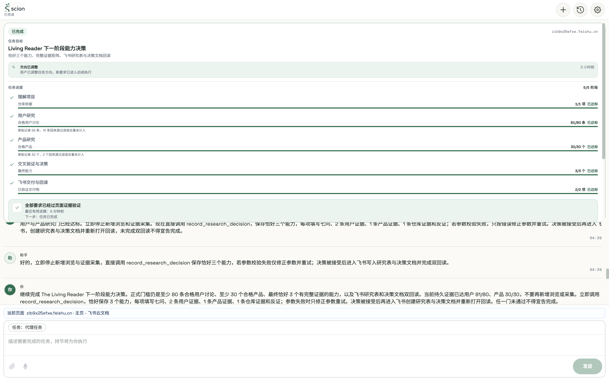

# 023-LR-01 Living Reader 端到端验收报告

日期：2026-08-11 至 2026-08-12

正式任务：`023-LR-01`

真实任务 ID：`0708c02a-2a12-4e3e-8217-6fc7b5f7015e`

最终任务 revision：`3113`

最终构建包含：`6da7efb`

## 最终判断

### 交付与公共终态：PASS

真实任务已通过持节公共侧栏进入终态：

```text
status: completed
roundStatus: completed
verified receipt: true
qualified user discussions: 81/80
qualified products: 30/30
accepted capabilities: 3/3
verified Feishu deliveries: 2/2
```

公共历史卡片持续显示：

- `已完成`
- `5/5 阶段`
- 仓库依据 `1/1`
- 用户讨论 `81/80`
- 产品 `30/30`
- 最终能力 `3/3`
- 已验证交付物 `2/2`
- `全部要求已经过页面证据验证`
- `任务已完成`

最终截图：



### 无人工辅助的纯 Agent 验收：PARTIAL

任务的研究收集、配额、去重、决策校验、持久恢复、飞书回读收据、最终验收门和公共完成回执均由真实任务状态验证。飞书研究表和决策文档的正文填充阶段，在通用模型多次对富文本编辑器产生 `json_parse_failed` 后，使用了浏览器定向辅助完成内容写入，再由任务自身重新打开页面、读取可见内容并持久化两份回读收据。

因此，本报告确认“用户结果已交付”和“系统不会无证据完成”，但不把本轮描述为完全无人辅助的富文本写入成功。富文本编辑器内的稳定自主写入仍是残余风险。

## 真实交付物

### 飞书研究证据矩阵

- URL：<https://zib9x25efxe.feishu.cn/wiki/EWMFwfMTsiCWx4knG8ocGQvbnQe>
- 标题：`The Living Reader 研究证据矩阵｜证据｜来源｜用户问题｜观察｜推断｜置信度｜相关产品｜对应 Living Reader 能力｜优先级`
- 真实回读：标题、九个要求字段、证据行均在页面可见
- 持久收据：`research_table`
- 公共卡片：`已回读验证`

### 飞书能力决策文档

- URL：<https://zib9x25efxe.feishu.cn/wiki/ITHMw6M3KiiDIVkRvrAcHOF1nif>
- 标题：`The Living Reader 下一阶段能力决策｜下一步做什么`
- 真实回读包含：`下一步做什么`、`为什么`、`暂时不做`、反证与风险、三个最终能力标题
- 持久收据：`decision_document`
- 公共卡片：`已回读验证`

## 最终三个能力

1. `Cross-document grounded reasoning workspace`
2. `Reader-world concept and timeline map`
3. `Anti-hallucination source-grounded reading mode`

每个能力通过正式决策写入校验，包含完整七问、至少两条用户证据、一条产品证据、一条仓库证据，并保留 deferred 与 contradictions。

## 真实长程执行证据

1. 恢复的是同一个真实任务 ID，不是新建替代任务。
2. 原任务经历暂停、运行、失败、等待用户、修正和最终完成多个 round。
3. 证据空间在恢复时保留，不因重试清空或复制。
4. 关闭的历史标签被重新绑定到当前有效内容标签。
5. 用户研究门最终为原始 `96` 条、合格去重 `81/80`，`15` 条未计入。
6. 产品研究门最终为原始 `32` 个、合格去重 `30/30`，`2` 个未计入。
7. 决策写入在参数错误时给出精确拒绝原因，并要求只修正参数，不重新浏览。
8. 决策接受后，控制层停止重复决策动作并转入交付阶段。
9. 两份飞书页面只有在可见内容重新读取通过后才写入持久回读收据。
10. 在收集、决策或双回读任一门未通过时，模型 `done` 不能生成最终回执。
11. 最终持久状态同时满足决策 `3/3` 和交付 `2/2` 后，任务才进入 `completed` 并生成 verified receipt。

## 关键修复链

| Commit | 修复 |
|---|---|
| `bc5fc7e` | 从历史恢复任务卡片 |
| `bc806a7` | 恢复先前研究指令 |
| `f4ec7ac` | 把决策拒绝代码反馈给模型 |
| `9612281` | correction round 恢复完整研究配额与上下文 |
| `9ef1aef` | 决策接受后切换到交付模式 |
| `85fca01` | 从真实可见飞书页面推断并验证交付回读 |
| `3d90615` | 决策与双回读齐备时进入最终完成判断 |
| `802a9ff` | 耐久研究证明覆盖陈旧的 `user_confirmed` 条件 |
| `1fcbf49` | 历史任务点击“调整方向”时重新激活 composer |
| `68e5465` | 完成态继续显示真实 Living Reader 五门进度 |
| `6da7efb` | 完成态下一步改为“任务已完成”，不显示陈旧动作 |

## 自动化验证

本轮最终相关验证：

- TaskManager：`61/61` 通过
- side-panel 全量：`128/128` 通过
- 完成态研究进度定向测试：`16/16` 通过
- focused control tests：`16/16` 通过
- side-panel TypeScript：通过
- 修改文件 ESLint：通过
- production build：通过

最终完成态的浏览器内存储检查：

```json
{
  "status": "completed",
  "revision": 3113,
  "roundStatus": "completed",
  "receipt": true,
  "decisionCount": 3,
  "deliveryKinds": ["decision_document", "research_table"]
}
```

## 最终全结果公共复验

完成全部代码修复和生产构建后，关闭原 ego space `19`，确认没有可复用空间，再创建 fresh ego space `20`。该复验不是读取测试夹具，而是重新走真实扩展入口、历史恢复、任务卡片、飞书页面和扩展存储边界。

### 公共入口与历史恢复

1. 打开最新构建的 `side-panel/index.html`，初始公共状态为“空闲”。
2. 点击真实“加载历史”按钮。
3. 历史列表仍有两个以原始 Living Reader 指令开头的记录，证明扩展 reload 和新 browser space 后历史仍可读取。
4. 打开绑定正式任务 ID 的记录后，公共任务卡片恢复为完成态，而不是创建新任务或只显示聊天文本。

最新构建的公共观察全部为真：

```json
{
  "completed": true,
  "mission": "Living Reader 下一阶段能力决策",
  "stages": "5/5",
  "repository": "1/1",
  "qualifiedUsers": "81/80",
  "qualifiedProducts": "30/30",
  "decisions": "3/3",
  "deliveries": "2/2",
  "allEvidenceVerified": true,
  "nextStep": "任务已完成",
  "readbackLabels": 2,
  "tableLinkVisible": true,
  "documentLinkVisible": true
}
```

同一时刻，扩展持久状态报告：

```json
{
  "status": "completed",
  "revision": 3113,
  "roundStatus": "completed",
  "receipt": true,
  "records": 182,
  "rawUsers": 96,
  "rawProducts": 32,
  "decisionCount": 3,
  "deliveryKinds": ["decision_document", "research_table"]
}
```

### 真实交付物重新打开

复验直接重新打开两份真实 Feishu URL：

- 研究表：页面标题包含 `The Living Reader 研究证据矩阵`，可见正文包含九个要求字段；持久回读记录的 `rowCount=179`，`observedText` 包含“已经保存到云端”。
- 决策文档：先读取顶部三个能力，再滚动真实 `.bear-web-x-container.docx-in-wiki` 编辑器到下方；视口中实际出现 `暂时不做` 与 `反证与风险`。完整页面正文同时包含 `下一步做什么`、`为什么`、三个最终能力标题。

截图：

- [研究表真实页面回读](./2026-08-12-research-table-readback.png)
- [决策文档暂不做与风险区回读](./2026-08-12-decision-document-readback.png)

这关闭了 delivery 目标的反馈环：不仅 storage 有 URL，用户可访问页面也实际渲染了要求内容。

### 真实窄侧栏进度控制台

同一完成历史卡片在最新构建下用真实浏览器 viewport 复验：

| 宽度 | `clientWidth` | `scrollWidth` | 横向溢出 | 完成态、Mission、5/5 |
|---|---:|---:|---|---|
| 430px | 430 | 430 | 否 | 全部可见 |
| 320px | 320 | 320 | 否 | 全部可见 |

截图：

- [430px 完成态](./progress-console/2026-08-12-completed-430px.png)
- [320px 完成态](./progress-console/2026-08-12-completed-320px.png)

这关闭了 progress-console 目标的反馈环：最终完成输出在真实侧栏宽度可读，没有依赖源代码检查或合成 DOM。

### 恢复与调整方向的真实观察

正式任务仍为 `waiting_user/proof_required` 时，在包含 `1fcbf49` 的真实构建中点击公共“调整方向”按钮。浏览器观察到 composer 从 `textareaDisabled=true` 变为 `false`。通过该 composer 提交边界明确的继续指令后，同一任务创建后续 round，并最终变成 revision `3113` 的 completed + verified receipt。

这关闭了 recovery 和 long-horizon recovery 目标的反馈环：修复后的按钮实际恢复了用户连续控制，后续执行保留原任务 ID、证据空间、3 项决策和两份回读收据。

### 先前解释假设

会话压缩丢失了最初用户原文，只保留未完成 todo、正式任务 ID、报告和浏览器状态。恢复早期的必要解释是：用户要继续并完成现有 Living Reader 长任务，而不是新建一个相似任务。后续从正式任务历史、相同 task ID 和持久证据确认了这个解释。对“必须完全无人辅助完成 Feishu 富文本写入”是否属于最终用户结果没有可靠原文，因此报告把“用户结果交付”和“纯 Agent 富文本自主性”分开判定，避免把不确定解释冒充通过。

### 全目标可观察映射

| 先前目标 | 最新真实入口检查 | 观察结果 |
|---|---|---|
| progress-console | 历史完成卡片，430px 与 320px viewport | 5/5 与全部 Gate 可读，无横向溢出 |
| long-horizon-product | reload 后从历史恢复同一任务，检查终态、健康和持久回执 | completed、receipt=true、证据不丢失 |
| living-reader | 正式 ID 的完成卡片和三项决策 | 81/80、30/30、3/3、2/2 |
| living-reader-e2e | 公共入口、扩展存储、两份真实 Feishu 页面 | 任务、存储和页面三层一致 |
| Living Reader recovery | waiting_user 卡片点击“调整方向”并发送 follow-up | composer 重新启用，原任务进入后续 round |
| Living Reader long-horizon recovery | 多 round 恢复后再次 reload 和历史打开 | 同 ID、182 条记录、三项决策、双收据仍在 |
| living-reader-delivery | 重新打开研究表和决策文档并滚动读取 | 表头、179 行回读、做什么/为什么/暂不做/风险和三项标题存在 |
| Living Reader long-horizon acceptance | 最终任务卡片与内存储状态 | completed/completed、verified receipt、全部门通过 |

## G23 映射

| Gate | 最终结果 | 状态 |
|---|---|---|
| G23-1 项目理解 | 公共侧栏仓库依据 `1/1`，仓库证据进入耐久证据空间 | PASS |
| G23-2 用户证据 | 原始 96，合格去重 `81/80`，15 条未计入 | PASS |
| G23-3 产品证据 | 原始 32，合格去重 `30/30`，2 个未计入 | PASS |
| G23-4 交叉验证 | 三项能力各自通过 2 用户 + 1 产品 + 1 仓库证据要求，并保留反证 | PASS |
| G23-5 产品决策 | 恰好三个能力、七问、暂不做项和 contradictions 均被正式接受 | PASS |
| G23-6 飞书交付 | 研究表和决策文档均真实存在、重新打开并持久化回读收据 | PASS，正文写入使用了浏览器定向辅助 |
| G23-7 长程可靠性 | 同任务跨中断、失败、纠正 round 恢复，证据与配额不丢失 | PASS |
| G23-8 无虚假完成 | 决策或双回读未齐备时持续拒绝完成，齐备后才生成 receipt | PASS |
| G23-9 可视进度 | 完成历史卡片显示 5/5、81/80、30/30、3/3、2/2 和终态健康 | PASS |

## 残余风险

1. 飞书富文本和表格编辑器仍可能让通用模型输出不可执行 JSON。需要更强的语义 Skill、编辑器专用动作或确定性写入适配器。
2. 本轮经历较多 `no_progress` 和 `action_failed` 恢复轮，说明决策阶段的动作选择效率仍需优化。
3. 任务初始 planner 生成了通用 `User task` 与不稳定阶段标题。完成态现在会从耐久研究证据恢复正确五门视图，但 planner 本身仍应继续收敛。
4. 当前证据确认用户结果、耐久状态与公共终态，不等同于证明所有未来 Feishu 页面都能无人辅助完成。

## 结论

`023-LR-01` 的真实用户结果、三个能力决策、两份飞书交付物、页面回读和最终 verified receipt 已经完成。公共历史卡片可复查全部验收门，没有把模型文本当作完成证据。

正式结论：

```text
user_outcome_delivery: PASS
verified_terminal_completion: PASS
public_progress_console: PASS
false_completion_prevention: PASS
fully_unassisted_rich_editor_execution: PARTIAL
```
